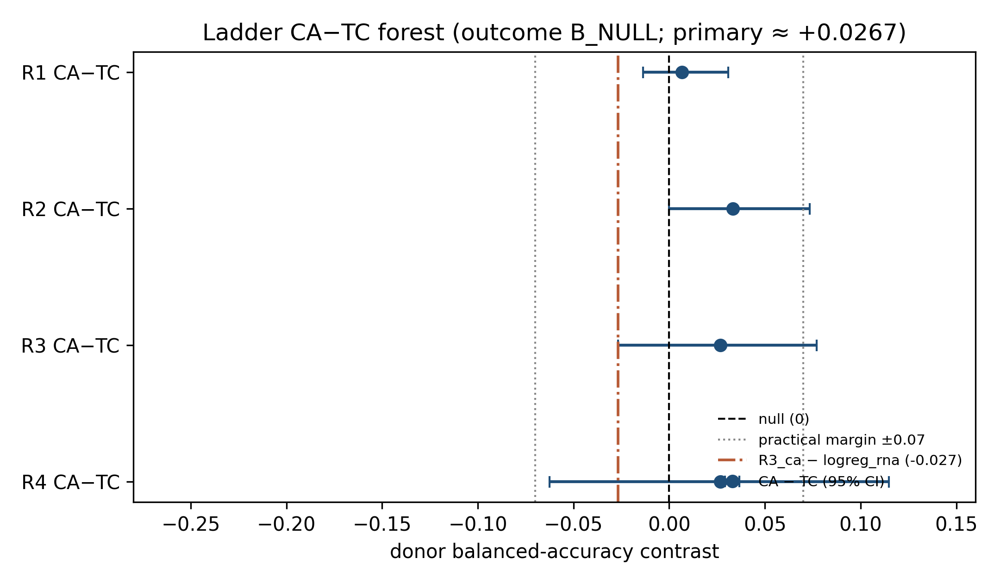
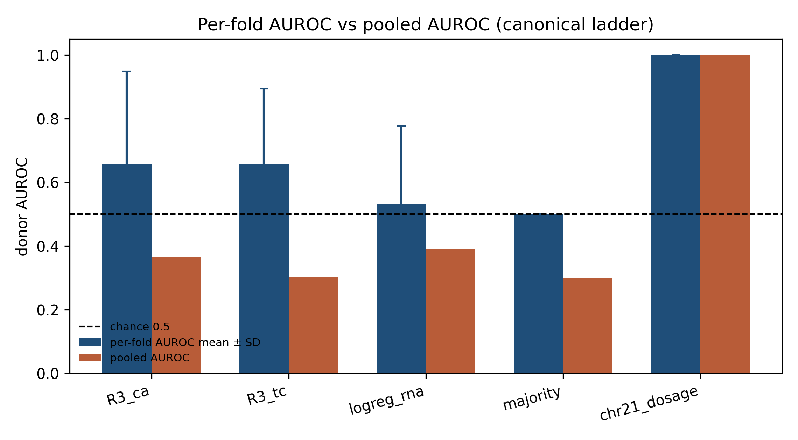
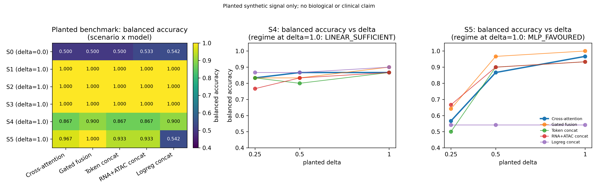
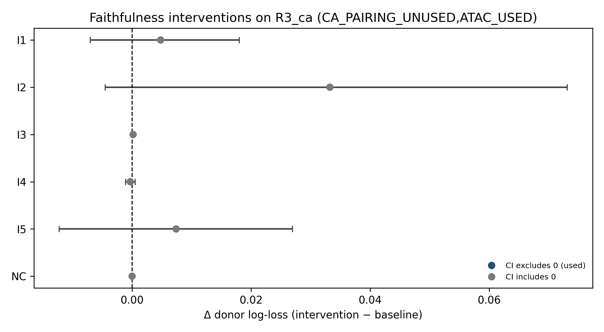
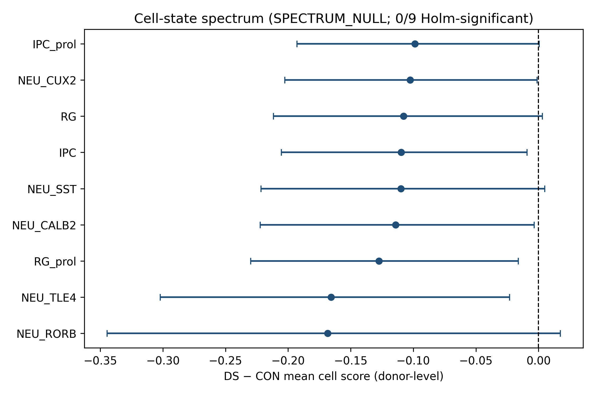
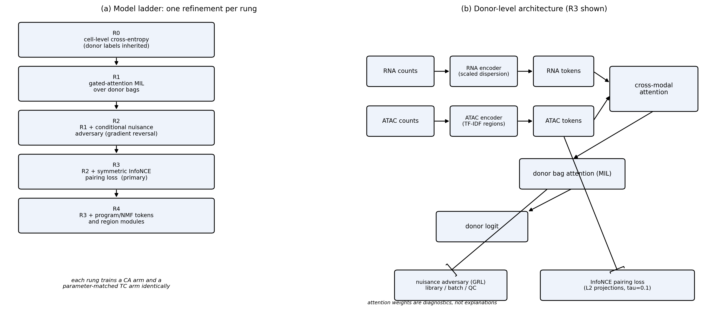

<!--
P22-NN paper draft. Section authorship is tracked by task: N28 wrote Introduction and
Related Work; N26 wrote Methods; N27 wrote Results and claims.csv; N29 wrote Discussion
and Limitations; N30 wrote the title and Abstract. The References section is left for a
later typesetting pass; all in-text keys are validated against refs_frozen.bib.
Final label: DRAFT_V2_COMPLETE
-->

# Paired RNA+ATAC cross-attention shows no donor-level gain over RNA-linear baselines in a 30-donor developmental cortex cohort

## Abstract

Cross-modal attention is often used to fuse paired single-cell RNA and ATAC, but
donor-level gain over matched non-attention fusion is rarely tested. We ran a
donor-held-out ladder on thirty developmental-cortex donors with a planted-signal
benchmark. On the canonical ladder after a shared-path control-fit fix, the primary
contrast R3 cross-attention minus matched token-concatenation donor balanced
accuracy is 0.0267 with a 0.95-level CI of [-0.0267, 0.0770] (verifier recomputed
[-0.025, 0.077]); the practical margin of 0.07 is unmet (outcome B_NULL). RNA
logistic regression exceeds the attention arm (pooled BA 0.427 versus 0.400).
Learned-arm pooled AUROC sits below chance while per-fold AUROC means are above
chance, so we report per-fold AUROC alongside pooled metrics; a forced-chr21
positive control reaches donor AUROC 0.924. Model-free chr21 dosage remains at
ceiling (AUROC 1.0), and excluding chr21 genes leaves disease-state BA near chance
(DOSAGE_DOMINATED). Across planted regimes, including a gene-matched RNA×ATAC
interaction, none favour cross-attention. We conclude that, at this power and on
this cohort, paired RNA+ATAC cross-attention shows no donor-level disease-state
gain over RNA-linear or token-concat baselines.

## Introduction

Many single-cell assays now measure RNA and chromatin accessibility in the same
cell, producing paired multiome profiles. A natural modelling choice is to fuse the
two modalities rather than analyse them separately, and cross-modal attention has
become a common fusion tool in other areas of machine learning. It is less clear,
however, when attention adds anything over simpler fusion on paired single-cell data.
A linear model on concatenated features, or a simple gated sum, can already capture
complementary information when the modalities carry consistent signal.

We study this question on paired single-cell RNA and ATAC profiles: when does
cross-modal attention help, and when are non-attention baselines sufficient? We treat
the question as an empirical one and answer it with an internal, donor-held-out
comparison. The protocol pairs a planted-signal benchmark, in which the pairing
structure and the class boundary are known, with a real disease-state task. The
planted benchmark asks whether an attention advantage appears in regimes where the
label depends on the joint configuration of the two modalities; the real task tests
whether any such advantage survives on measured data.

The design is an adapted combination of known techniques: multiple-instance learning
with attention, conditional nuisance removal by gradient reversal, and a contrastive
auxiliary objective, assembled into a single donor-level model. We do not claim the
components as new. We report both positive and negative outcomes, and we state where
the evidence does not support an attention advantage. All comparisons use
donor-held-out folds, and inference is done at the donor level, following the
pseudobulk literature.

## Related Work

**Multimodal single-cell integration.** Weighted nearest neighbours assign each cell a
set of modality weights and are a known precedent for per-cell modality weighting
[@hao2021integrated]. MOFA+ factorises multi-omics data into shared and
modality-specific factors [@argelaguet2020mofa]. MultiVI jointly models RNA and ATAC
with a variational autoencoder [@ashuach2023multivi]. These methods are established,
and the present work treats them as reference points rather than as baselines; the
baseline set is restricted by our protocol.

**Cross-modal attention.** Attention is the central building block of transformers
[@vaswani2017attention]. Multimodal transformers fuse unaligned modality sequences
with cross-modal attention [@tsai2019multimodal], and attention bottlenecks were
proposed to scale audiovisual fusion [@nagrani2021attention]. Attention also underlies
deep multiple-instance learning [@ilse2018attention], which motivates a donor-level bag
formulation. Contrastive objectives have been used to align modalities
[@oord2018representation; @radford2021learning].

**Attention and interpretation.** Whether attention weights explain a model's
decisions is contested [@jain2019attention; @wiegreffe2019attention]. We therefore
treat attention weights as diagnostics to be probed, not as explanations, and we test
whether the model uses the pairing.

**Nuisance and inference.** Domain-adversarial training removes nuisance signal by
gradient reversal [@ganin2015unsupervised; @ganin2016domain]. Single-cell differential
expression is best performed with the donor as the unit of inference
[@squair2021confronting]. Chromatin accessibility is summarised as gene activity over
gene bodies and upstream windows [@stuart2021signac], and matrix factorisation
provides a classical alternative for shared structure [@lee1999learning]. The source
cohort used here is annotated in the same study [@lattke2026down], so it is a
development resource rather than an independent validation cohort.

## Methods

**Data and cohort.** We analyse paired single-cell RNA and ATAC profiles from one
development cohort. The processed expression matrix holds 248,998 cells and 35,477
genes; raw counts are retained in `raw/X`, because the `X` layer is already normalised.
Disease status, author cell type, donor identity, library, sequencing batch, developmental
stage, sex and technical quality columns (`nCount_RNA`, `nCount_ATAC`, `TSS.enrichment`,
`percent.mt`, `nucleosome_signal`) are all present in `obs`. Donor is the unit of
inference throughout [@squair2021confronting]. ATAC is represented by unique
fragment-overlap counts over a 465-region union; the per-fold region set is chosen by
training-library prevalence and is an unbiased-order selection, not a regulatory
annotation. The cohort is annotated in the same source study [@lattke2026down].

**Cell sampling.** Each donor contributes at most 1,000 cells (sampling seed 22), drawn by
a stable donor × author-cell-type × library stratified sampler. The historical
256-cell-per-donor sample is kept as the reproduction reference. Sampling is fixed before
any label is read and balances cell counts across donors and strata.

**Representation.** RNA counts are transformed per cell as
`log1p(1e4 · raw_count / cell_total_raw_count)`. Within each outer-training fold, the top
2,000 genes are selected by label-free normalised dispersion, and each gene is
standard-scaled using training cells only. ATAC counts are transformed per cell by TF-IDF,
`log1p(tf · idf)`, with IDF fitted on training cells only, over the per-fold 256-region
training-only set. Every fitted transform — gene selection, scaler, IDF and region set —
is fitted on outer-training cells; outer-test donors never influence any fit.

**Model ladder.** The ladder adds one refinement per rung, and at every rung a
cross-attention (CA) arm and a matched token-concatenation (TC) arm are trained
identically: same donors, splits, cells, features, head and selection budget. R0 is a
cell-level cross-entropy model with inherited donor labels. R1 replaces cell-level
training with gated-attention multiple-instance learning over donor bags of 64 cells
[@ilse2018attention]; attention is `a_i = softmax_i(wᵀ(tanh(V h_i) ⊙ sigmoid(U h_i)))`,
the bag embedding is `H_b = Σ_i a_i h_i`, and the donor probability is `sigmoid(f(H_b))`
trained with binary cross-entropy. Per-cell scores `s_i = f(h_i)` are exported for
held-out donors. R2 adds a conditional gradient-reversal nuisance adversary
[@ganin2015unsupervised; @ganin2016domain] on library (cross-entropy), sequencing batch
(cross-entropy) and a five-column standardised QC vector (mean squared error), with one
hidden layer of 64 units and gradient-reversal slope `γ(p) = 2/(1+exp(−10p)) − 1`; the
adversary is conditional on the disease label because two batches contain disease donors
only. R3 adds a symmetric InfoNCE pairing loss [@oord2018representation;
@radford2021learning] between L2-normalised 32-dimensional projections of the RNA and
ATAC views at temperature `τ = 0.1` within each minibatch. R4 replaces the learned latent
tokens with training-only NMF gene-program tokens and region modules [@lee1999learning].
The total objective is `L = L_MIL + λ_adv·L_adv + λ_nce·L_nce`.

**Architecture and training.** The frozen widths are 8 latent tokens, embedding 32,
hidden 128, dropout 0.2, 4 attention heads, attention width 64, gate hidden 32, region
width 32 with 4 heads, adversarial hidden 64, pairing projection 32 and latent width 64.
Training uses Adam at 1e-3, minibatch 64, at most 30 epochs, early stopping with patience
6 on inner-validation donor log-loss, model seed 0, on CPU with one torch thread per
worker and at most 14 workers. `λ_adv` and `λ_nce` are selected from {0.1, 1.0} on
inner-validation donor log-loss: R2 selects `λ_adv`, R3 selects both without carrying the
R2 winner forward. Cross-modal attention follows the multimodal-transformer
[@tsai2019multimodal] and attention-bottleneck [@nagrani2021attention] precedents, with
transformer attention as the underlying block [@vaswani2017attention]; per-cell modality
weighting is a known precedent [@hao2021integrated]. Gene-activity summaries follow gene
body plus upstream windows and TF-IDF summarisation [@stuart2021signac]. The components
are an adapted combination and are not claimed as new. Sklearn control arms fit on the
full outer-train donor split of each fold (not only the inner-train third).

**Evaluation contract.** Every arm is evaluated on the same 5 × 5 repeated stratified
donor folds (split seed 0), with a 3-fold inner donor split of the training donors for
validation. The primary endpoint is donor balanced accuracy of `R3_ca` minus `R3_tc`, with
a pre-declared practical margin of 0.07 and a 1,000-draw donor-cluster bootstrap
confidence interval (bootstrap seed 22); secondary endpoints are donor AUROC, donor
log-loss and donor Brier score. Alongside pooled donor AUROC we report per-fold AUROC
(mean and SD over the 25 outer folds) because pooling fold-specific scores across
stratified folds can depress pooled AUROC relative to within-fold ranking. Rung rejection
rules are pre-declared: R1 is rejected if donor log-loss is not lower than R0 for both CA
and TC; R2 if the held-out nuisance probe does not drop at least 5 points versus R1, or
donor balanced accuracy falls by more than 0.05; R3 if pairing retrieval top-1 is at most
twice chance, or donor log-loss is worse than R2; R4 if donor balanced accuracy is more
than 0.05 below R2. A rejected rung is still reported, and the primary contrast remains
fixed at R3.

**Controls and matching.** Comparators are logistic regression on RNA, logistic regression
on concatenated RNA+ATAC features, a pseudobulk RNA logistic model, a chromosome-21
dosage baseline, a majority-class baseline, a gated-fusion arm, and a parameter-matched
token-concatenation arm required to stay within 10% of the cross-attention parameter count
(5% informational). A latent PCA(RNA)+LSI(ATAC) model is included as a classical
alternative. As a pipeline positive control, one logistic arm is retrained with the
feature set forced to include every chr21 gene (union with the default HVGs) on repeat 0
(5 folds). No external cohort is used; all results are internal and donor-held out.
Diagnostic interventions probe whether predictions depend on the pairing (within-donor,
within-cell-type ATAC permutation) and on the learned attention, but attention weights are
treated as diagnostics rather than explanations [@jain2019attention;
@wiegreffe2019attention].

## Results

**Primary real-data contrast is a null.** On the accepted ladder (`ladder_v3`; 450/450 folds; verifier `PASS`), the pre-declared endpoint is donor balanced accuracy of `R3_ca` minus `R3_tc`. The estimate is 0.0267 with a 0.95-level donor-cluster bootstrap CI of [-0.0267, 0.0770] in the rebuilt summary (verifier recomputed CI [-0.025, 0.077] at three decimal places). The practical margin of 0.07 is unmet and `advantage` is false, so the outcome is `B_NULL` (Fig. 3). Secondary label `LINEAR_SUFFICIENT`: RNA logistic pooled BA 0.427 exceeds `R3_ca` 0.400 (paired delta -0.0267). Pooled BAs for selected arms are `R3_tc` 0.373, `R3_gated` 0.367, `logreg_concat` 0.413, and majority 0.300; the verifier notes that majority pooled BA below 0.5 reflects fold-wise threshold pooling, so AUROC should be read alongside BA. Model-free chr21 dosage remains at ceiling (BA 1.0; AUROC 1.0).

**Per-fold AUROC and below-chance pooled scores.** Across all 18 arms, per-fold AUROC and BA were scored fold-wise before pooling. Majority per-fold BA is exactly 0.5 in every fold. Learned arms show a pooling gap: `R3_ca` per-fold AUROC mean 0.656 (SD 0.293) versus pooled AUROC 0.366; `R3_tc` 0.658 (SD 0.236) versus pooled 0.302; `logreg_rna` 0.534 versus pooled 0.390 (Fig. 6). The below-chance diagnosis after the shared-path control-fit fix is `PIPELINE_BUG_FIXED`: sklearn controls were under-trained on the pre-fix ladder, which was rebuilt as `ladder_v3`; pooling of fold-specific scores across stratified folds still depresses pooled AUROC, so per-fold AUROC is reported alongside pooled metrics. Predictions were never flipped.

**Positive control through the full pipeline.** Forcing every chr21 gene into the HVG union and reusing the same fold preparation, training loop and donor aggregation yields logreg pooled donor AUROC 0.924 over the five folds of repeat 0 (orientation Spearman of predicted DS probability versus donor chr21 share 0.648). Default HVG selection kept about 31 of 538 chr21 genes per fold, so dosage signal is mostly dropped before training unless forced in.

**Sampling and parameter matching.** The primary stratified sample uses a 1,000-cell cap, draws 30,000 cells from 30 donors out of 248,998 available cells, finds seven two-library donors, holds max per-stratum deviation to 2 cells, and passes. The historical 256-cell reproduction draws 7,680 cells from the same 30 donors and also passes. A fold-preparation smoke with sampler seed 22 yields 30,000 cells, 35,477 genes and 465 regions in the union, a 2,000-gene / 256-region training-only feature set, and peaks at 4.153 GiB resident memory. The parameter-matched token-concatenation arm has 380,026 parameters against the 384,250-parameter `R3_ca` target (relative error 0.010993), inside both the 10% acceptance rule and the 5% informational bound. R2/R3 CA share 384,250 parameters; R4 CA/TC are 29,970 and 25,746.

**Planted benchmark: no `CA_FAVOURED` regime.** Across 16 planted regimes, 13 are `LINEAR_SUFFICIENT` and 3 are `MLP_FAVOURED`; none are `CA_FAVOURED` (Fig. 2). At the null point S0@0.0, cross-attention sits at 0.5 against a 0.5417 best non-attention baseline (concatenation logistic regression), a gap of 0.0417, inside the 0.35–0.65 null band. When the planted signal is unambiguous (S1@0.25), every scored model is at or above 0.9; cross-attention is 0.9667 while concatenation logistic regression reaches 1.0. In the linear-baseline failure cell S5@1.0, concatenation logistic regression remains at 0.5417, cross-attention reaches 0.9667, and gated fusion reaches 1.0; the check that S5 stays within 0.05 of chance fails by design. Planted labels are synthetic only. An added gene-matched RNA×ATAC interaction regime (S6; δ = 0.5 and 1.0; 5 folds) likewise yields no `CA_FAVOURED`: gene-aligned CA and feature-concat MLP both reach mean BA 1.0 at both δ, while gene-aligned token-concat is weaker (0.70 at δ = 0.5; 0.8667 at δ = 1.0).

**Dosage domination and seed stability.** After excluding chr21 features, no-chr21 BAs are `R3_ca` 0.333, `R3_tc` 0.373, `logreg_rna` 0.407, and `logreg_concat` 0.400 — each meets the decision-tree `DOSAGE_DOMINATED` rule. Fixed-protocol seed sensitivity under `seeds_v3` (frozen R3_ca width 384250) yields model-seed spread 0.073 and sampling-seed spread 0.033 with labels `[SPREAD_ONLY]` (not `SAMPLING_SENSITIVE`).

**Faithfulness, nuisance probe, and attention readouts.** Held-out interventions on 25 folds × arms `R3_ca`/`R3_tc`/`R3_gated`/`R4_ca` give tags `CA_PAIRING_UNUSED` and `ATAC_USED`; the no-change control (NC) Δ log-loss is exactly 0.0 on every scored arm (Fig. 4). I1 log-loss CI excludes 0 for `R3_tc`; I1 on `R3_gated` and I3/I4/I5 on `R3_ca` include 0. Planted pairing positive control (PC) is `N/A` (no saved S4/S5 δ=1.0 models under `ladder_v3`), so pairing-use claims stay provisional. The held-out nuisance probe rejects R2 for both CA and TC (`R2_REJECTED` / `PROBE_DROP_INSUFFICIENT`): CA batch-seq probe accuracy is 0.056 at R1 and 0.066 at R2 and does not drop by the required 5 points versus R1, while library probe is unscorable on 0/150 fold-arm rows under donor hold-out. All three N17 attention/routing readouts are `NOT_SHOWN_USED` (I4/I6 CIs include 0); attention weights are diagnostics, not explanations [@jain2019attention; @wiegreffe2019attention].

**Cell-state spectrum and secondary gene activity.** Out-of-fold cell scores cover 120,000 rows across four arms with five appearances per cell×arm asserted; chr21-excluded scores cover 60,000 rows and are `EXPORTED`. On `R3_ca` alone the spectrum call is `SPECTRUM_NULL`: 9 eligible cell types, support floor of 20 cells per donor and 8 donors per group, and no Holm-significant DS−CON difference at α=0.05 (Fig. 5). The spectrum compare on chr21-excluded scores is also `SPECTRUM_NULL` (same 9 eligible types; 0 Holm-significant DS−CON differences). Optional gene-aligned CA under the 500-gene amendment (panel 548 → 500) is secondary only and never independent external validation: `GA_ca`−`GA_tc` estimate 0.0533, CI [-0.0527, 0.1572], outcome `GA_B_NULL`; GA faithfulness tags are `GA_ATAC_UNUSED_OR_NULL`, `GA_CA_PAIRING_UNUSED`, and `GA_ATTENTION_NOT_SHOWN_USED`, with NC exact zero.

## Discussion

We asked whether cross-modal attention yields a donor-level gain on paired single-cell
RNA+ATAC, and what detectability limits follow. Under the accepted F4 framing the answer
is a rigorous negative: on the verified real-data ladder the primary contrast
`R3_ca`−`R3_tc` is a null (`B_NULL`), RNA logistic remains the stronger secondary arm
(`LINEAR_SUFFICIENT`), and the planted grid—including the gene-matched interaction—
contains no `CA_FAVOURED` regime. When the planted signal is absent, models stay in the
null band; when it is unambiguous, a linear model on concatenated features already
reaches the ceiling; when the linear baseline fails, gated fusion—not cross-attention—is
the strongest non-attention comparator. Parameter matching rules out a capacity
explanation for this pattern.

The real-data null is consistent with dosage domination and with faithfulness. After
dropping chr21 features, scored arms stay at or below the declared no-chr21 BA cutoff
(`DOSAGE_DOMINATED`), while model-free chr21 dosage remains at ceiling. Held-out
interventions tag `CA_PAIRING_UNUSED` and `ATAC_USED`; I3/I4/I5/I6 CIs on the primary
cross-attention arm include zero, so pairing use and attention-route claims stay
unsupported, and every N17 readout is `NOT_SHOWN_USED`. Attention weights are diagnostics
to be probed, not explanations [@jain2019attention; @wiegreffe2019attention]. The
nuisance adversary fails its held-out probe-drop rule (`R2_REJECTED`), so we do not claim
technical-factor erasure. Out-of-fold cell scores yield `SPECTRUM_NULL` on `R3_ca` with
and without chr21 features: no Holm-significant DS−CON difference among eligible types.
Seed spreads under the frozen widths stay modest (`SPREAD_ONLY`). Below-chance pooled
AUROC on learned arms is a pooling artefact relative to per-fold AUROC, not a reason to
flip predictions.

Optional gene-aligned CA under the 500-gene amendment is also a null
(`GA_B_NULL`) and remains secondary measurement only—not independent external validation.
Taken together, the benchmark cautions against attributing donor-level gains to
cross-modal attention without matched token-concat and RNA-linear controls, and it states
the detectability limits that follow when neither planted nor real-data endpoints favour
the attention arm.

## Limitations

Several limits bound these conclusions. The cohort contains thirty donors, so donor-level
contrasts are low-powered and between-donor variance cannot be characterised with
confidence. All work is on a single internal development cohort with no external
validation, so the estimates carry no transportability guarantee. The disease-state
annotations are same-cohort labels from the developing Down syndrome cortical atlas
[@lattke2026down] and were not independently adjudicated. The ATAC region panel is a
prevalence / tie-break window set, not a curated regulatory panel; the gene-activity
rerun (N21) uses a gene-window amendment and remains secondary only.

Interpretation is further restricted by incomplete controls. The planted pairing positive
control is `N/A` (no saved S4/S5 δ=1.0 models under `ladder_v3`), so I3 pairing-use claims
stay provisional even though NC is exact zero. Attention is not treated as explanation:
all N17 readouts are `NOT_SHOWN_USED`. R2 does not pass the held-out probe-drop rule, so
library and batch confounding are not shown to be erased. Developmental stage (age) is
recorded in the cohort metadata but is not residualized or probed as a disease-state
confounder beyond the declared library / batch / QC adversary. Majority and some learned
arms show pooled BA/AUROC below chance from pooling fold-specific scores across stratified
folds; per-fold AUROC and the forced-chr21 positive control (donor AUROC 0.924) should be
read alongside pooled metrics, and the validity verdict is `PIPELINE_BUG_FIXED` after the
control-fit rebuild. Every planted signal is synthetic, so the benchmark speaks to
detectability on constructed labels and carries no biological claim. This study is
separate from the earlier August same-cap and September paired corrected analyses.

## References
