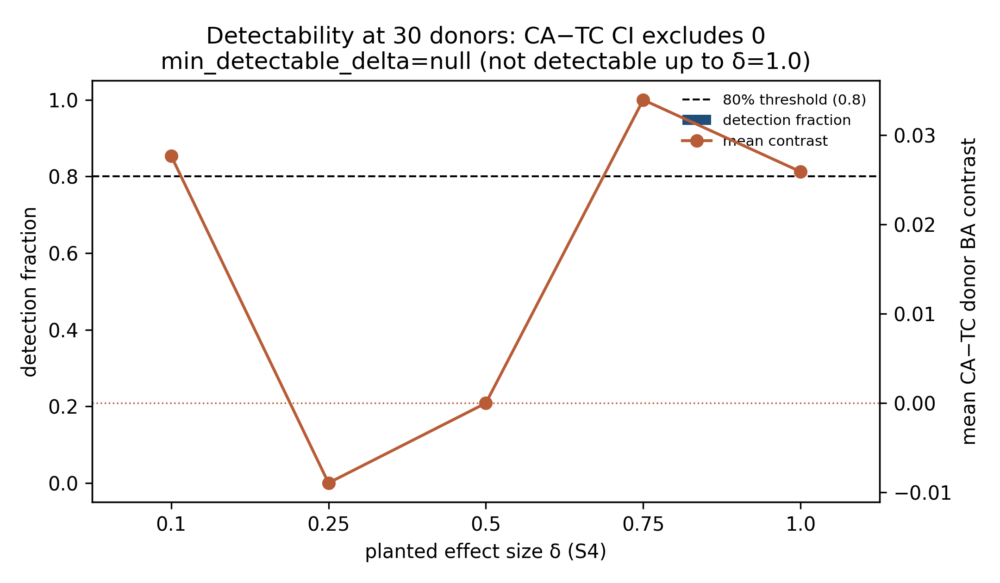

<!--
PROVISIONAL venue adaptation for BMC Research Notes (Research note).
Source: copy of accepted paper/draft.md scientific content, condensed to documented
Research-note limits (Abstract ≤200 with Objective/Results; Introduction + main +
Limitations ≤2000; ≤3 display items). Accepted numerical results unchanged.
Frozen citation keys retained. Accepted paper/draft.md, short_paper.md and claims.csv
were not modified for this copy.

Status: provisional — researcher must confirm venue. Not submission-ready.
Export remaining: Springer/BMC manuscript Word or online submission system formatting
is unsupported in-repo; keep this Markdown source until researcher export.
Revision: SUBMISSION_PROVISIONAL_BMC_RN_2026-10-03
-->

# Cross-modal attention versus matched token fusion in a 30-donor developmental cortex cohort

**Provisional target:** BMC Research Notes — Research note (see `tasks/submission_readiness_20261003/VENUES.md`). Not submitted.

## Abstract

**Objective.** Determine whether cross-modal attention improves donor-held-out Down syndrome classification over matched token concatenation on paired single-cell RNA and ATAC from thirty developmental-cortex donors [@lattke2026down].

**Results.** Attention balanced accuracy was 0.400 and token concatenation 0.373; the difference was 0.0267 (95% donor-cluster CI [-0.0250, 0.0768]), below the 0.07 practical margin. An attention advantage was not demonstrated; equivalence was not established. RNA logistic regression reached 0.427 and donor-level pseudobulk RNA logistic regression 0.513 (descriptive only). Chromosome 21 dosage reached donor AUROC 1.0. Constructed-signal checks did not establish a discriminating attention advantage or real-data statistical power.

## Introduction

Paired single-cell RNA and ATAC profiles invite fusion models, including cross-modal attention. It remains unclear when attention improves donor-level prediction over simpler fusion that sees the same cells and features. We treat the question as an internal comparison: planted-signal regimes where the joint label is known, and a real donor disease-label task on one developmental-cortex atlas [@lattke2026down]. Donor hold-out follows biological-replicate reasoning in differential expression [@squair2021confronting]; it does not guarantee transportability. We report where the evidence does not support an attention advantage and where controls fail their fixed gates.

## Related Work

Weighted nearest neighbours, MOFA+ and MultiVI combine paired modalities for broader integration goals [@hao2021integrated; @argelaguet2020mofa; @ashuach2023multivi]. Multimodal transformers and attention bottlenecks motivate cross-modal fusion [@tsai2019multimodal; @nagrani2021attention; @vaswani2017attention]; attention-based multiple-instance learning motivates donor bags [@ilse2018attention]. Attention weights are treated as diagnostics to probe, not as explanations [@jain2019attention; @wiegreffe2019attention]. Domain-adversarial training and contrastive pairing objectives appear in the ladder as declared components [@ganin2015unsupervised; @ganin2016domain; @oord2018representation; @radford2021learning]. Gene-activity summaries follow established window practice [@stuart2021signac]; NMF tokens are a classical alternative [@lee1999learning].

## Methods

**Data and sampling.** We analyse 248,998 processed paired cells from 30 donors [@lattke2026down]. Each donor contributes at most 1,000 cells (seed 22), stratified by author cell type and library. Outer folds hold out entire donors. Within each outer-training fold we select 2,000 RNA genes by label-free dispersion and 256 ATAC regions by training-library prevalence (not a curated regulatory panel). RNA uses training-only standard scaling after `log1p` library normalisation; ATAC uses training-only TF-IDF. Donor is the unit of inference [@squair2021confronting].

**Ladder and primary contrast.** Matched cross-attention (CA) and token-concatenation (TC) arms share donors, splits, cells, features, head and selection budget. The accepted primary rung (R3) adds InfoNCE pairing loss to gated-attention multiple-instance learning with a conditional nuisance adversary. Sklearn RNA, concatenated-feature, gated-fusion, majority, chromosome-21 dosage and donor-level pseudobulk RNA logistic regression supply descriptive comparisons. Before looking at the result we set 0.07 donor balanced-accuracy points as the practical margin for a useful CA−TC gain. Parameter counts are 384250 (CA) and 380026 (matched TC); relative error 0.010993. Evaluation uses five repeats of five donor-held-out folds; the primary estimand is donor balanced accuracy of `R3_ca` minus `R3_tc`, summarised with a donor-cluster bootstrap CI. Predictions were never flipped to improve a metric.

**Follow-ups (secondary).** Chromosome-21 exclusion and forced-retention sensitivities, planted-signal regimes including a gene-matched interaction, faithfulness interventions, nuisance-probe checks, cell-score spectrum tests and a constructed-signal detectability grid are reported as secondary. Later synthetic controls (S7–S10) are summarised by their fixed gate dispositions only.

## Results

**Primary advantage is not demonstrated.** On the accepted ladder (`ladder_v3`; verifier `PASS`), saved-fold replay gives CA−TC donor balanced accuracy 0.0267 with 95% CI [-0.0250, 0.0768]. The difference is below the 0.07 margin and the interval includes zero: label `B_NULL` (advantage not demonstrated; not an equivalence claim).

| Arm | Donor balanced accuracy | Donor AUROC |
|---|---:|---:|
| `R3_ca` | 0.400 | 0.358 |
| `R3_tc` | 0.373 | 0.332 |
| `logreg_rna` | 0.427 | 0.398 |
| `pseudobulk_rna_logistic` | 0.513 | 0.557 |

Larger RNA and pseudobulk point estimates do not establish superiority. Model-free chr21 dosage has BA 1.0 and AUROC 1.0. Other descriptive BAs include `R3_gated` 0.367, `logreg_concat` 0.413 and majority 0.300.

**Pooling, dosage and planted checks.** Per-fold AUROC means exceed all-repeat pooled AUROC for learned arms (for example `R3_ca` 0.656 versus 0.366), so per-fold and pooled summaries must not be interchanged (Fig. 1). After excluding chr21 features, scored arms meet the declared `DOSAGE_DOMINATED` rule (`R3_ca` 0.333; `R3_tc` 0.373; `logreg_rna` 0.407; `logreg_concat` 0.400). Across 16 planted regimes none are `CA_FAVOURED`; a gene-matched interaction check likewise yields no `CA_FAVOURED`. Faithfulness tags include `CA_PAIRING_UNUSED` and `ATAC_USED`; planted pairing positive control is `N/A` under `ladder_v3`. The nuisance probe rejects R2 (`R2_REJECTED`). Spectrum calls on `R3_ca` are `SPECTRUM_NULL`. A chr21-forced secondary has pooled CA−TC 0.060 (CI [0.011, 0.113]) while its mean-fold CI includes zero; primary `B_NULL` is unchanged.

**Detectability and later controls.** On planted S4 at 30 donors, detection fraction is 0.0 at every tested δ up to 1.0; `min_detectable_delta` is null (Fig. 2). This does not establish power for the real-data contrast (`POWER_UNESTABLISHED`). S7/S9/S10 remain `INVALID`; S8 is `NO FIT`. These dispositions do not validate a method, establish pairing use or prove a dataset defect.

## Discussion

In this cohort, chromosome 21 dosage discriminates donors strongly, and the primary comparison does not establish a useful attention advantage over matched token fusion. RNA and pseudobulk baselines have larger descriptive BA point estimates without an accepted superiority claim. Pairing use and attention-route claims remain unsupported; the nuisance adversary fails its held-out probe-drop rule. The comparison concerns donor disease labels from one atlas. It does not measure independent cell-state maturation and has no external validation.

## Limitations

Donor *n* = 30 leaves the primary estimate imprecise; statistical power for the real-data contrast is unestablished. Detectability finds no CA−TC CI excluding 0 up to planted δ = 1.0. The ATAC panel is prevalence-selected. Disease labels are same-cohort annotations [@lattke2026down]. Developmental stage is recorded but not separately residualized beyond the declared adversary. Planted signals are synthetic. Pooling across stratified folds can depress pooled AUROC relative to per-fold scores. Later invalid controls supply no method validation.

## Internal provenance and guidance note

The later masked-ATAC pilot is excluded from accepted quantitative results. Scientific acceptance remains `NOT_AUTHORIZED` (diagnostic replay only). Execution-repair stage E5 remains `NO_GO` for an automatic new pilot. The independently measured cell-state endpoint remains `ENDPOINT_UNRESOLVED`. Original professor meeting records are direction only; worker gates bind the numbers above. No new fits were run for this provisional adaptation.

## Declarations (BMC Research Notes — researcher-owned stubs)

Required BMC headings are listed. Values are unresolved unless noted. Do not invent funding, conflicts, authors, ethics approvals or release URLs. Status: **provisional adaptation; submission pending researcher inputs**.

| BMC heading | Status | Owner | Completion condition |
|---|---|---|---|
| Ethics approval and consent to participate | Unresolved | Researcher | Exact secondary-use / atlas reuse wording, or documented “Not applicable” if venue accepts that for this analysis |
| Consent for publication | Unresolved | Researcher | Exact statement or “Not applicable” |
| Availability of data and materials | Partial | Researcher | Atlas citation [@lattke2026down] present; add accession/repository links required by BMC |
| Competing interests | Unresolved | Researcher | Disclosure text or explicit none |
| Funding | Unresolved | Researcher | Exact funding text or explicit none |
| Authors’ contributions | Unresolved | Researcher | Confirm authors, affiliations and CRediT-style roles |
| Acknowledgements | Unresolved | Researcher | Text or “Not applicable” |
| Code / software availability | Partial | Researcher | In-repo paths and verifier commands exist; add public release URL if required |
| License choice (CC BY vs CC BY-NC-ND) | Unresolved | Researcher | Select at submission |
| Venue confirmation | Unresolved | Researcher | Confirm BMC Research Notes Research note or name replacement venue |

**Remaining export requirement.** Markdown source only. BMC/Springer Word or online submission packaging (template, figure upload, reference style in the portal) is not produced here.

No submission-ready claim is made.

## References

Expanded from `paper/refs_frozen.bib` (verified metadata frozen 2026-09-24; keys unchanged). Only keys cited above are listed.

1. [@lattke2026down] Lattke, Michael; Tan, Wee Leng; Sukumaran, Salil Kalarikkal; Utami, Kagistia Hana; Sintes, Marcos; Sakthivel, Srinivasan; Tan, Jonathan; Lim, Auriel; Bansal, Vibhavari Aysha; Rekopoulou, Katerina; Matthews, Nik; Alić, Ivan; Krsnik, Željka; Nižetić, Dean; Levi, Boaz P.; De Paola, Vincenzo. Single-cell atlas of the developing Down syndrome brain cortex. *Nature Medicine* 32(3):1061–1072, 2026. DOI: 10.1038/s41591-026-04211-1.

2. [@squair2021confronting] Squair, Jordan W.; Gautier, Matthieu; Kathe, Claudia; Anderson, Mark A.; James, Nicholas D.; Hutson, Thomas H.; Hudelle, Rémi; Qaiser, Taha; Matson, Kaya J. E.; Barraud, Quentin; Levine, Ariel J.; La Manno, Gioele; Skinnider, Michael A.; Courtine, Grégoire. Confronting false discoveries in single-cell differential expression. *Nature Communications* 12, 2021. DOI: 10.1038/s41467-021-25960-2.

3. [@hao2021integrated] Hao, Yuhan et al. Integrated analysis of multimodal single-cell data. *Cell* 184(13):3573–3587.e29, 2021. DOI: 10.1016/j.cell.2021.04.048.

4. [@argelaguet2020mofa] Argelaguet, Ricard; Arnol, Damien; Bredikhin, Danila; Deloro, Yonatan; Velten, Britta; Marioni, John C.; Stegle, Oliver. MOFA+: a statistical framework for comprehensive integration of multi-modal single-cell data. *Genome Biology* 21, 2020. DOI: 10.1186/s13059-020-02015-1.

5. [@ashuach2023multivi] Ashuach, Tal; Gabitto, Mariano I.; Koodli, Rohan V.; Saldi, Giuseppe-Antonio; Jordan, Michael I.; Yosef, Nir. MultiVI: deep generative model for the integration of multimodal data. *Nature Methods* 20(8):1222–1231, 2023. DOI: 10.1038/s41592-023-01909-9.

6. [@tsai2019multimodal] Tsai, Yao-Hung Hubert; Bai, Shaojie; Liang, Paul Pu; Kolter, J. Zico; Morency, Louis-Philippe; Salakhutdinov, Ruslan. Multimodal Transformer for Unaligned Multimodal Language Sequences. *ACL*, 2019. DOI: 10.18653/v1/P19-1656.

7. [@nagrani2021attention] Nagrani, Arsha; Yang, Shan; Arnab, Anurag; Jansen, Aren; Schmid, Cordelia; Sun, Chen. Attention Bottlenecks for Multimodal Fusion. *NeurIPS* 34, 2021. arXiv:2107.00135.

8. [@vaswani2017attention] Vaswani, Ashish; Shazeer, Noam; Parmar, Niki; Uszkoreit, Jakob; Jones, Llion; Gomez, Aidan N.; Kaiser, Łukasz; Polosukhin, Illia. Attention is all you need. *NeurIPS* 30, 2017.

9. [@ilse2018attention] Ilse, Maximilian; Tomczak, Jakub M.; Welling, Max. Attention-based Deep Multiple Instance Learning. *ICML*, PMLR 80, 2018. arXiv:1802.04712.

10. [@jain2019attention] Jain, Sarthak; Wallace, Byron C. Attention is not explanation. *NAACL*, 2019, pp. 3543–3556.

11. [@wiegreffe2019attention] Wiegreffe, Sarah; Pinter, Yuval. Attention is not not explanation. *EMNLP*, 2019, pp. 11–20.

12. [@ganin2015unsupervised] Ganin, Yaroslav; Lempitsky, Victor. Unsupervised Domain Adaptation by Backpropagation. *ICML*, PMLR 37, 2015. arXiv:1409.7495.

13. [@ganin2016domain] Ganin, Yaroslav; Ustinova, Evgeniya; Ajakan, Hana; Germain, Pascal; Larochelle, Hugo; Laviolette, François; Marchand, Mario; Lempitsky, Victor. Domain-Adversarial Training of Neural Networks. *JMLR* 17(59), 2016. arXiv:1505.07818.

14. [@oord2018representation] van den Oord, Aaron; Li, Yazhe; Vinyals, Oriol. Representation Learning with Contrastive Predictive Coding. arXiv:1807.03748, 2018.

15. [@radford2021learning] Radford, Alec; Kim, Jong Wook; Hallacy, Chris; Ramesh, Aditya; Goh, Gabriel; Agarwal, Sandhini; et al. Learning Transferable Visual Models From Natural Language Supervision. *ICML*, PMLR 139, 2021. arXiv:2103.00020.

16. [@stuart2021signac] Stuart, Tim; Srivastava, Avi; Madad, Shaista; Lareau, Caleb A.; Satija, Rahul. Single-cell chromatin state analysis with Signac. *Nature Methods* 18(11):1333–1341, 2021. DOI: 10.1038/s41592-021-01282-5.

17. [@lee1999learning] Lee, Daniel D.; Seung, H. Sebastian. Learning the parts of objects by non-negative matrix factorization. *Nature* 401(6755):788–791, 1999. DOI: 10.1038/44565.
