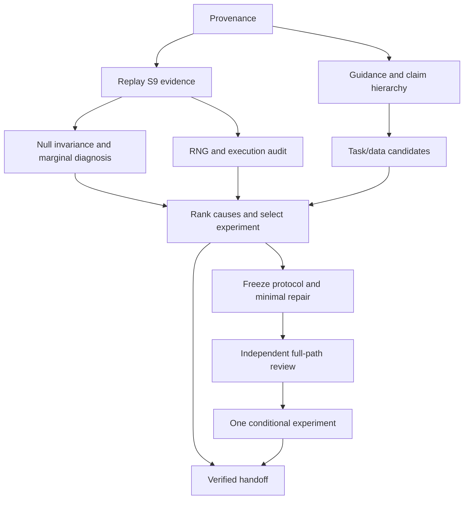

# Failure audit and professor-aligned next experiment — 2026-10-01

## Objective

Identify why the S9 control was invalid, check whether our task requirements match Professor Fang's intended research, and choose one testable next experiment. Do not repeat the S9 screen, widen its marginal/null limits, or search seeds until CA wins. A valid negative experiment is useful; a completed audit is not biological validation.

Extend the existing P22 plan and root checklist. Detailed acceptance and verification below define R0–R10. This stage begins from clean reviewed-run closeout commit `67245a2b19de9d6fb094fc01190590d9362d6d43`. Prior B_NULL, S7 INVALID, S8 NO FIT, S9 INVALID and study partial remain immutable historical results.

## Initial evidence and questions

| Finding | Evidence | Interpretation to test |
|---|---|---|
| S9 49/49 fits completed, marginal gate failed; null pairing positive | Prior `next_stage_20260930/execute.json` and raw sidecars | Frozen INVALID retained; failure mechanism not yet diagnosed |
| rho=0 forces exact orthogonality, permutation breaks it | [fresh no-fit diagnostic](NULL_INVARIANCE_DIAGNOSTIC.json); `s9_analytic.py` generator | Zero sample covariance does not establish exchangeability of paired rows |
| Mean absolute shuffled donor/channel product 0.14653; original max abs 1.73e-16 | Same diagnostic, seeds 4001–4016 | Distribution mismatch confirmed for this statistic; causal explanation of neural result remains unknown |
| Two concurrent thread workers; model construction/training reset global Python/NumPy/torch RNG | `s9_execute.py`, `multiome_runner.py::paired_model`, `training/loop.py::set_all_seeds` | Reproducibility risk; prove effect on tiny fixed diagnostic jobs before proposing repair |
| Q9 hashes cover generator/protocol/splits/ledger, but executor introduced at Q10 is outside that listed set | Prior `NO_FIT_REVIEW.json`, `VERIFICATION.json`, `s9_execute.py` | Audit full review/commit chronology; distinguish reviewed design from executor verification |
| Unimodal BA 0.75/0.708 at 24 donors | Prior saved predictions | May be finite-sample nuisance association, threshold/pooling effect, bug or structural shortcut; BA alone does not prove leak |
| Endpoint gate requires independent cell-state truth orthogonal to RNA | Prior Q2/Q11 records | Appropriate for some biological claims; potentially too broad for self-supervised or descriptive cell-state research |

Do not infer leakage from a single null-positive 95% CI. False positives can occur under a valid test; repeated simulation and valid exchangeability/estimand reasoning distinguish chance from systematic error. Current exact-orthogonality constraint is a concrete design concern, independent of the observed neural effect.

## Professor guidance and claim boundary

Re-read original July 2 and July 21 vault MOM: granular cell-state spectrum, mathematical customization, equal supervision, complex independently measured modalities, concatenation/simple baselines and held-out faithfulness tests. Disease-vs-control was one proposed direction; successful DS classification is not the only possible test of routing.

Build a claim hierarchy rather than one universal endpoint gate:

1. **Software/mechanism control:** analytically generated target and oracle. Validates computation or constructed pairing use only.
2. **Computational prediction:** externally withheld measured genes/ATAC regions, or a predefined masked-modality objective. Validate train/test masking and donor isolation. It need not have an external cell-state label, but cannot by itself prove biological state or causal mechanism.
3. **Descriptive cell-state/program analysis:** RNA-derived programs may be used with explicitly disclosed construct validity and held-out readouts. Same genes cannot define and evaluate the target; splitting alone does not eliminate biological circularity. Transportability and independent corroboration strengthen interpretation.
4. **Biological state/perturbation claim:** independent measurement, perturbation or defensible orthogonal validation commensurate with the claim. Synthetic controls and reconstructed features alone cannot establish it.

Review this hierarchy against original guidance and primary methods before accepting a new task. Do not silently relabel historical Q2 as PASS. Record any amendment prospectively with its narrower claims.

## Dependencies

R2/R3/R4/R5 reports may proceed independently after prerequisites; separate output ownership required. No model fitting concurrent with protocol edits. Default neural execution is serial until process isolation/determinism is demonstrated. No user-owned chats or outbound messages required.

## R0 — Pin source and preserve evidence (S; no dependencies)

**Description:** Establish isolated worktree/source ownership and shared raw paths. Copy this plan, prompt and initial no-fit diagnostic into the new worktree; append only this stage's plan/checklist entries. Preserve all main dirty files and old outputs.

**Acceptance:**
- [ ] `PREFLIGHT.md` records base/head, source hashes, interpreter/import location, input/raw roots, available resources and writer inventory.
- [ ] New output root, cumulative counters and output-overwrite refusal defined; no writes through shared old-result symlinks.
- [ ] Original primary/S7/S9/professor/sent-packet hashes recorded; old raw evidence available or precise missing-evidence blocker named.

**Verification:** `git status --short`, `git rev-parse HEAD`, streaming hashes; Python imports and `p22.__file__` with worktree `PYTHONPATH`. No dependency install. **Files:** preflight, copied owned documents. **Scope:** S.

## R1 — Replay S9 and review coverage (M; R0)

**Acceptance:**
- [ ] Independently recompute 49-fit coverage, per-arm pooled/per-fold donor BA and primary pairing drops/CI from saved sidecars/checkpoints without fitting or rewriting old summaries.
- [ ] Trace generator→split→fit→checkpoint→reload→shuffle→aggregate→bootstrap→gate, including versions/parameters and complete review chronology. Check actual epochs/selection history if available; five-second reported fit total alone proves neither adequate learning nor failure.
- [ ] `S9_AUDIT.md` distinguishes protocol failure, implementation deviation, uncertain optimization, statistical fluctuation and missing provenance. Preserve INVALID even if replay code needs correction.

**Verification:** Reuse sidecar/checkpoint replay functions read-only; independently check simple BA calculations and donor identity/label matching. Validate prediction hashes against ledger. Review both original and shuffled predictions, metrics and review artifacts. **Files:** audit report/JSON, one small replay helper/test only if existing APIs cannot replay without mutating raw roots. **Scope:** M.

## R2 — Diagnose null and marginal failure without training (M; R1)

**Acceptance:**
- [ ] Reproduce initial exact-orthogonality/shuffle finding. Derive conditional distribution/exchangeability requirements and show which planted and nuisance constraints are preserved or broken.
- [ ] Explain whether original pairing statistic tests cell-pair exchangeability, label relevance, or some mixture. Quantify null/marginal uncertainty using saved predictions and analytic/simulation checks; distinguish independent donor draws from repeated resampling of 24 donors.
- [ ] Supply an analytically justified candidate null for the intended future claim, or `NULL_DESIGN_UNRESOLVED`. No fit-based calibration by constant/Bernoulli predictions and no threshold chosen from S9 outcomes.

**Verification:** At most 256 preregistered generator-only draws, fixed seed schedule committed before simulation; zero model fits. Test original/shuffled cross-product distributions, marginal moments, identity/permutation invariants and simple independent-draw reference. Prove independence claims analytically where possible; a moment check alone is insufficient. Label any proposed new generator as a diagnostic alternative, not a successful replacement S9. **Files:** `NULL_AUDIT.md`, diagnostic helper, focused tests, new JSON. **Scope:** M.

## Checkpoint A — After R1/R2

Saved-result replay and null-contract reasoning independently checked. Failures yield precise findings; they do not justify changing old results. Continue guidance/task and execution audits even when S9 replay is blocked.

## R3 — Audit execution determinism and resource accounting (M; R1)

**Acceptance:**
- [ ] Inventory every caller of globally seeded model/fit/reload APIs. Determine whether concurrent thread use creates cross-job RNG interference; do not infer effect merely from threading.
- [ ] Freeze tiny diagnostic tensors, seeds, model dimensions, training settings, repetitions and tolerances before training. Compare repeatability in serial versus existing thread route; at most **12 diagnostic fit attempts**, including failed attempts, ≤15 minutes. These diagnose code, not S9 scientific performance; no full S9 jobs or favourable seed selection.
- [ ] If confirmed, propose smallest repair: serial jobs first, or demonstrated process isolation only when needed. Check counters reserved before dispatch, crash-safe writes, failed-attempt accounting, runtime stop enforcement, checkpoints and resumability.

**Verification:** Focused reproducibility regression, identity/reload tests and deliberate failure/resume fixture; sequential diagnostic reruns use same inputs and report all differences. Separate reviewer approves exact diagnostic fit spec before its 12-fit allowance is used; unavailable review means read-only code audit still completes. Hash actual executor and its full dependency path. **Files:** execution report, minimal runner fix and focused tests if warranted, diagnostic ledger. **Scope:** M; split repair from review/run if >5 files.

## R4 — Reconcile objective and endpoint gates (S; R0)

**Acceptance:**
- [ ] Guidance-to-claim table cites exact original MOM passages and separates professor requests from worker restrictions.
- [ ] Review four-level claim hierarchy above; identify which existing endpoint gate applies to which claim and any prospective amendment required.
- [ ] Record whether computational paired-modality prediction or descriptive cell-state research can proceed with current inputs, without portraying proxies as independent biological truth.

**Verification:** Original MOM and primary-method citations; reviewer checks endpoint construction/input-target overlap and permitted interpretation. Later objective-approval records must be considered before stating professor endorsed a changed disease task. Do not impose a new universal wet-lab requirement absent scientific reason. **Files:** `GUIDANCE_AND_CLAIMS.md`, gate table. **Scope:** S.

## R5 — Compare task/data paths (S; R4)

**Acceptance:**
- [ ] Evaluate current-data repair, one masked-measurement/pairing prediction task, and at most three public primary-source candidate datasets with relevant measured targets.
- [ ] Candidate table gives independent donors, paired assays, objective/target validity, leakage risks, feature/count compatibility, metadata/payload sizes, reuse/access constraints and exact evidence status. If counts unknown, say unknown.
- [ ] Preserve NeMO as external test unless prospectively reassigned. Dataset change recommended only when a measured problem is addressed by a feasible candidate; current DS null alone is insufficient.

**Verification:** Fresh official dataset/paper/code sources with URLs/date and bounded source ledger. Avoid fabricated identifiers/counts or mirror-based independence claims. Existing current paired matrices already structurally pass; do not repeat obsolete raw-GEO peak incompatibility as if it applied to exact recounts. **Files:** `TASK_DATA_OPTIONS.md`, source ledger/JSON. **Scope:** S. No new payloads yet.

## Checkpoint B — After R3–R5

Execution risk and claim hierarchy reviewed; candidate metadata report complete or bounded. Independent safe audits finish before stopping. No new biological claim or experiment follows merely from a relaxed endpoint definition.

## R6 — Make a data-driven decision (S; R2/R3/R5)

**Acceptance:**
- [ ] `DECISION.md` ranks causes by evidence strength and states what new evidence would change the conclusion. Explicitly distinguish null invalidity, learned-model inadequacy and dataset/task inadequacy.
- [ ] Select **one** next experiment: corrected software null/reproducibility test, current-data computational pilot, or bounded new-dataset ingestion/pilot. Do not combine three experiments or choose paper-only by default.
- [ ] Exact fit/download/resource arithmetic and expected inference limitations fit the budgets below. If no valid route exists, cost one concrete missing measurement/resource rather than proposing indefinite investigation.

**Verification:** Cross-reference every claim with evidence and original guidance. Fit feasibility is not established power. Effect assumptions and smallest useful result declared before new outcomes. **Files:** decision, budget ledger. **Scope:** S.

## R7 — Freeze new experiment and minimal implementation (M; R6)

**Acceptance:**
- [ ] New protocol ID/JSON/Markdown and split/feature manifest committed before scientific fits. Define target/estimand, null, positive-control role, class support, selection budget, fixed seeds/primary test, multiplicity, exclusions and outcome precedence.
- [ ] Use one matched simple/unimodal baseline, concat and CA when required by the question; justify other comparators. Mask input targets, keep donors disjoint, fit transformations only on training data, and preserve exact counted regions/zero semantics.
- [ ] Minimal implementation plus focused failure tests; no architecture rewrite absent measured need. Record mathematical customization only if it solves an established defect and is verified against primary methods.

**Verification:** Leakage fixtures, input/target disjointness, model parameter/training-budget comparison, finite gradients, reload, null invariants, output/identity/hash refusals and fit arithmetic. New seed schedule is fixed prospectively; never select it by S9/diagnostic performance. **Files:** protocol pair, existing-runner extension, focused tests; subdivide >5 files. **Scope:** M.

## R8 — Independent full-path review (S; R7)

**Acceptance:**
- [ ] Review includes **actual executor and all changed dependency code**, complete protocol, generator/null, selection, persistence, inference and claim hierarchy, not just generator hashes.
- [ ] Reviewer records exact reviewed Git commit/file hashes, evidence, PASS/FAIL/UNRESOLVED and scientific/resource criticisms. Worker self-review is not independent review.
- [ ] Critical issues resolved in at most two correction cycles. Review unavailable or irreparable means precise NO FIT and completion of safe reports.

**Verification:** Reviewer independently runs focused regressions and verifies exchangeability, leakage and budget math. Code changed after review invalidates affected authorization until re-reviewed. **Files:** `REVIEW.md`, machine review record. **Scope:** S.

## Checkpoint C — Before new scientific fits/acquisition

R7 protocol and R8 exact full-path review PASS required. Tiny diagnostic fits have their separate R3 allowance. Freeze artifact roots and cumulative attempts. Acquisition needs pinned object, exact purpose, size/checksum when provided, count semantics, sparse-loader/resource proof, and costed reviewed plan. Unknown dataset structural QC blocks predictive fits, not a bounded inspection explicitly designed to resolve it.

## R9 — Run one bounded experiment if justified (M; R8 PASS)

**Acceptance:**
- [ ] Fresh unique raw root with protocol/code/input/split hashes, all fit attempts, checkpoints, donor predictions and resource observations. Refuse old results and second scoring/selection loops.
- [ ] At most **90 scientific fits** plus the separate 12 diagnostic attempts, **six fitting hours**, one neural worker/two torch threads by default, **4 GiB artifacts**. Serial execution is permitted; parallel workers require isolated RNG/control proof.
- [ ] Replay primary statistic from saved outputs without refitting. Report INVALID/INCOMPLETE/VALID_NEGATIVE/VALID_POSITIVE for exact claim; no proxy/constructed result upgraded to biology.

**Verification:** Per-fit records include initial-state hash and training/validation history/epochs, selection rationale, model/input hashes, count coverage and donor identity. Persist attempt reservation before dispatch; resume respects counters and reviewed hashes. Compute summaries independently from sidecars. **Files:** runner/report/verification manifests, raw data. **Scope:** M; split acquisition and fit tasks if needed.

New acquisition ceiling: **256 MiB aggregate public data**, only exact R6/R8-approved targets after bounded source/loader checks; no large count/fragment atlas packages. Metadata limit **32 MiB/20 requests**, 30-second request timeout, no retries outside ledger. If useful candidate exceeds allowance, deliver a concrete larger-download proposal; do not truncate matrices and call them complete. No package installs, paid compute, controlled/proprietary data, author contact or external predictive evaluation in this command.

## R10 — Verify and close (S; all applicable tasks)

**Acceptance:**
- [ ] `HANDOFF.md` and `VERIFICATION.json` record each task DONE/BLOCKED/SKIPPED, scientific result, source/commit/log paths, remaining scientific/resource gap and one smallest next action.
- [ ] Preserve old claims and raw evidence; update worktree status/index only at accepted gates or material blockers. Commit only owned files; no merge/push/MOM/vault/sent-packet/outbound edits.
- [ ] Report what the experiment ruled out and what remains unidentified. A finished audit or software test cannot be called full project completion.

**Verification:** Focused tests appropriate to touched code, touched-file Ruff, `git diff --check`, link/hash checks and saved-output replay. Run required broader repository lint/fast checks once at integration; distinguish inherited failures from introduced ones. Never report stale test totals as fresh. **Files:** handoff/verification/status/index/task dispositions. **Scope:** S.

## Checkpoint D — Stop

Stop when R0–R10 have evidence-backed dispositions, one applicable experiment and replay are complete, and closeout is committed; or a precise scientific/resource blocker remains after all independent safe tasks finish. Maximum two correction cycles. No outcome-driven seed/gate/endpoint/model search or fresh-counter restarts. Every stage remains useful if results are negative.

## Risk and verification matrix

| Risk | Required check | Blocks |
|---|---|---|
| Incorrect shuffle null | Analytic exchangeability and no-fit distribution test | Pairing-use inference |
| Thread/global RNG interference | Fixed diagnostic reproducibility and isolated execution | Seed-controlled new scientific fits |
| Review omitted executor | Full-path commit/hash review | Acquisition/fitting authorization |
| Labels derived from same measurements | Input/target separation and explicit claim scope | Independent biological interpretation |
| Small donor count | Declared independent unit, split/class support and adequacy assumptions | Overstated generalization/power |
| Dataset-source mismatch | Exact provenance/count/paired-cell checks | Predictive pilot |
| Threshold chosen from prior failure | Prospective alternative grounded in analytic flaw, independent data/seeds | Confirmatory interpretation |

Existing libraries and infrastructure should be reused. No generic orchestrator/dashboard/framework. Separate review agents may review independent slices; one owner integrates scientific decisions and status. User launch of supplied command authorizes this scoped plan; do not request routine permissions again. Scientific review is an evidence gate, not a recurring permission request.
