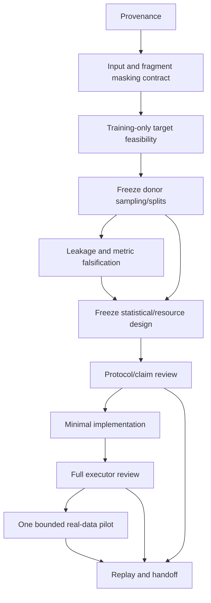

# Masked ATAC computational pilot — 2026-10-01

## Resume amendment — 2026-10-02: M10 closeout only

GNHF stopped at iteration 18 on the 20M token cap after M9 commit `a221c67`; M10 handoff/verification is not committed. Raw root contains 30 prediction sidecars and 30 attempt-ledger records; counters are 5 smoke + 25 main. Complete M10 from saved evidence only. No new learning, refits, smoke, target/seed/model changes, counter reset or new research stage. Preserve raw/counter hashes before and after replay.

**Review-coverage conflict:** M8 immutable hashes still match, but commit `315d6a9` introduced `src/p22/eval/masked_atac_pilot.py` (733 lines) and `scripts/run_masked_atac_m9.py` after M8 PASS. These implement real-data preprocessing, fit dispatch and resume authorization and are absent from M8's lock. Matching the older locked wrapper does not establish review of this new execution path. M9's statement of fully reviewed execution is provisional; task DONE is not scientific acceptance.

M10 independent reviewer must inspect actual full execution path, original review transcripts for any separate pre-fit coverage, fit histories/checkpoints, train-only preprocessing, chromosome masking, mixed-label donor metrics, parameter/selection budgets and counter progression. Report review timing. If no pre-fit independent review covered the new path, record failure of the prospective executor-review gate. Retrospective review cannot retroactively satisfy it. Preserve numerical replay as diagnostic evidence with that limitation; do not modify old M8 locks or silently promote scientific PASS.

Replay all 25 main sidecars with independently calculated donor-average losses and frozen bootstrap; check hashes, donor/cell/label/target equality and coverage. Verify five smoke records separately. Measure actual artifact bytes: counter `artifacts_gib.used=0.0` is not a filesystem measurement. Keep tracked reports compact rather than dumping per-cell JSON. Finish HANDOFF.md, VERIFICATION.json and Checkpoint D with scientific/task dispositions, actual command exits, reviewer identity, resources, claim limits and one next decision. If review unavailable, record precise blocker after safe replay work. Stop; no positive-result search.

## Objective and authority

Run one prospective exploratory computational benchmark on the existing paired cohort: can RNA plus visible ATAC predict a withheld measured accessibility target, and does cross-attention improve over matched token concatenation? Original July professor guidance motivates independently measured modalities, donor-held-out evaluation, fair concat/simple baselines and direct interventions. This is worker protocol design, not a recorded new professor endorsement.

The researcher requests the established detailed-plan/verification/GNHF workflow. Launch accepts this bounded continuation. Design, input, leakage and independent scientific review gates apply before any research fits. Claim level **2: computational prediction**. Q2 independent cell-state endpoint remains unresolved for stronger biological claims; it does not block a properly masked measured-target benchmark. Prior primary B_NULL and S7/S9/S10 INVALID/S8 NO FIT remain unchanged. No new synthetic pairing-control iteration or search for a positive result.

## Scope and simplest implementation

Proposed target is binary accessibility, **1 if exact region fragment-overlap count >0, otherwise 0**. Counts supply measured labels; this pilot does not reconstruct count magnitude or validate biological state. Existing two-class heads and training machinery can therefore be reused. Before accepting this choice, M2/M6 must justify that binary presence answers a useful computational question; if count reconstruction is required instead, report a separate regression-design proposal rather than silently expanding implementation.

Primary comparison: donor-average cell log-loss(token_concat) minus donor-average cell log-loss(CA), positive meaning lower CA loss. Predict cell labels, then average **losses within donor**; do not aggregate cell probabilities into a single donor class and treat that as the target. Thirty donors remain the independent units. One prespecified repeat of five outer donor folds; every donor held out once. Inner validation donors choose checkpoints by donor-average target log-loss.

Per-fold target selected by one frozen feature/availability rule using training donors only. Different targets between folds mean the primary estimand is the performance of a training-only target-selection algorithm, **not performance at one fixed genomic locus**. Report exact target/coverage per fold. One primary contrast; other arms and AUROC/Brier/BA are descriptive. Class absence in test folds does not justify dropping donors/targets; log-loss remains defined and class-dependent secondary metrics may be unavailable.

## Known starting evidence

- Launch base: reviewed R10 closeout commit `8c17ed86d04d78ab66e938db6a96fa4866e05bd2`.
- Local H5AD: 248,998 cells/30 donors; exact ATAC union 465 regions. Existing input manifest hashes, ordered cells and BED structurally checked in Q stage; recheck relevant contracts for this pilot.
- Fresh metadata-only BED inspection: **58 overlapping interval pairs** in the 465-region union, spread across 24 chromosomes. Exact target-ID removal alone is insufficient to prevent duplicated fragment information.
- R4 claim hierarchy and R5 current-data masked-target candidate permit computational feasibility review. S10 overall INVALID cannot establish method pairing use, but is not a required positive-result gate for this distinct measured-target prediction task.
- Neural seed/thread race was a code risk; tiny R3 experiment found no divergence under its fixed specification. Default serial fits avoids shared global RNG interference; no general thread-safety claim.

## Proposed masking contract

**Remove the entire target chromosome from the ATAC input** for that fold. This prevents any same-chromosome counted fragment from appearing in both target and visible ATAC, including overlapping or nearby intervals. Original per-fold target panels and target-coordinate provenance must be accounted for; no new peak/fragment acquisition.

- RNA remains independently measured input. RNA genes on target chromosome are not the same assay fragment; their prediction is part of the computational task, not causal evidence.
- ATAC normalization denominators, IDF, embeddings, PCA/LSI, gene activity and any learned preprocessing must use visible regions only. Do not compute a target-inclusive transform then zero the target column.
- Exclude full ATAC `nCount_ATAC`, `nFeature_ATAC`, target-inclusive QC/depth summaries, all-region latent scores and metadata/cell-type/disease labels from model inputs. RNA normalization may use RNA totals because RNA is a separate measured assay.
- Use chromosome naming/build and target interval semantics pinned to current exact counts. Genome/chromosome uncertainty blocks this masking claim until resolved.
- Choose candidate targets from a panel discovered without outer-test donors, with target eligibility statistics using inner-training donors only. Disclose inherited panel construction involving outer-training/validation donors. If strict train-only construction is claimed, prove it; do not hide inherited unsupervised provenance.
- For each fold, freeze one target and visible feature list before touching outer-test target outcomes. Never choose target by model performance, disease separation, or outer-test prevalence.

This is a deliberate conservative mask, not a universal method requirement. It may weaken ATAC input information; that defines the task and must be disclosed.

## Models and fit budget

| Arm | Role | Fits for five folds |
|---|---|---:|
| Training prevalence constant | Sanity/descriptive baseline | 0 |
| RNA-only logistic | Simple measured-modality control | 5 |
| Visible-ATAC-only logistic | Simple measured-modality control | 5 |
| Feature-concat MLP | Required simple fusion control | 5 |
| Token-concat | Matched primary comparator | 5 |
| Cross-attention | Primary model | 5 |

**25 planned main fits**, up to **5 additional fixed smoke/trainability fits**, **30 total intended / hard cap 40 attempts** including failures, calibration/smoke and any sanctioned retry. Six fitting hours; one neural worker/two torch threads; at most 4 GiB new artifacts. No hyperparameter/seed/target/region-budget sweep. One fixed model seed and sampling seed, committed before fits. A scientific budget calculation may alter the proposed arm set/settings only before protocol freeze and independent review, within these ceilings.

Use matched cells, RNA/visible-ATAC features, train/val/test donor IDs, neural selection budget and supervision across primary arms. Parameter difference ≤10% or explicit justified matched-control design before fits. Keep simpler controls intentionally simple. Log exact architecture/loss/settings and initial-state hashes.

## Dependencies

Independent interval/provenance checks within M1 may proceed concurrently with separate outputs. M4 requires the frozen M3 manifests. Target selection, protocol freezing, model code and fitting are sequential. No concurrent writers to status/checklist or raw roots.

## Task M0 — Pin provenance and runtime (S; no dependency)

**Description:** Isolate the new continuation at reviewed R10 commit; preserve old outputs and main dirty files.

**Acceptance:**
- [ ] Copy only this stage's plan/prompt to new worktree, matching source hashes; append this M0–M10 block to root plan/checklist without overwriting prior tasks.
- [ ] Record base/head, actual `p22.__file__`, installed interpreter, source/input hashes, shared raw paths, runtime headroom and writers in `PREFLIGHT.md`.
- [ ] Define unique output root and durable counters; old primary/S7/S9/S10 results and vault/MOM/sent packet remain read-only.

**Verification:** Read applicable AGENTS/status/index and original July MOM; verify installed dependencies using absolute existing venv and worktree `PYTHONPATH`. Verify Git head/status and owned file hashes. **Files:** preflight/copied documents. **Scope:** S.

## Task M1 — Verify measured inputs and masking contract (M; M0)

**Acceptance:**
- [ ] Exact count matrix/hash/dimensions/ordered-cell/BED/coordinate checks pass; original panel-to-donor provenance traced for candidate repeat/folds.
- [ ] Quantify target/input overlap and confirm whole-target-chromosome mask eliminates shared-fragment target leakage under documented counting semantics.
- [ ] `INPUT_AND_MASKING.md` distinguishes measured-zero from missing input, target labels from visible features, and inherited processing limits. Missing evidence yields `INPUT_UNRESOLVED`.

**Verification:** Reuse Q replay/hash checks; hand-check half-open interval overlap and same-chromosome fragments, including boundary cases. Assert all visible ATAC chromosome IDs differ from target chromosome. No full expression-atlas densification. **Files:** input report/JSON, small reused diagnostic extension/tests if required. **Scope:** M.

## Task M2 — Establish training-only target feasibility (M; M1)

**Acceptance:**
- [ ] Freeze deterministic candidate ranking from inner-training data: chromosome/region IDs, minimum positive/negative cell and donor support, count depth and eligible panel provenance. Numerical criteria and ranking committed before inspecting outer-test target labels.
- [ ] Evaluate feasibility on training-only values; choose one target per fold or report NO_TARGET_SUPPORT. Avoid disease labels and CA outcomes. No outer-test label/prevalence-driven exclusions.
- [ ] Record binary target rationale, sparse/imbalanced support, visible-feature counts after masking and fold-to-fold target variation. No fixed-locus or regulatory-function claim.

**Verification:** Test that changing outer-test target values cannot change target identity, feature list, normalization or eligibility. Verify disjoint target chromosome and deterministic ties. No learning/fits. **Files:** target-selection helper, focused tests, `TARGET_FEASIBILITY.md/json`. **Scope:** M.

## Task M3 — Freeze donor splits and paired sampling (S; M2)

**Acceptance:**
- [ ] Fix one repeat of five outer donor folds and one inner validation partition per fold before outcomes. Reuse archival donor split when appropriate, with disclosed original stratification; no disease label model input.
- [ ] Same paired cells per donor across all arms; proposed cap 256/donor, seed 22, label-free donor×type×library sampling. Numerical sampling changes need prior feasibility justification, not performance feedback.
- [ ] `SPLITS_AND_SAMPLING.json` pins exact donor/cell IDs and hashes; target and visible-feature masks per fold pinned. Class-dependent test metrics report unavailable rather than dropping donors.

**Verification:** Donor disjointness, each outer-test donor once, one metadata/label join per cell, paired row identity, seed replay; existing sampling/group-split tests. RNA-derived cell types are strata only. **Files:** manifests/report. **Scope:** S.

## Checkpoint A — Input/target support

M1–M3 evidence checked; exact measurements and training-only selection valid; visible ATAC remains adequate for a multimodal comparison. No target, all-zero visible modality, or unresolved mask contract blocks model fitting but allows complete feasibility handoff.

## Task M4 — Falsify leakage and metric mistakes (M; M1/M3)

**Acceptance:**
- [ ] Artificial target-count changes leave encoded RNA/visible ATAC and every fit statistic unchanged, including normalization denominators and derived summaries. Test target/overlap/chromosome/depth leakage refusals.
- [ ] Tiny deterministic arrays verify binary label/count mapping, clipped probability log-loss, average cell-loss within donor and equal donor weighting; oracle and constant predictions verify evaluator direction without fits.
- [ ] No disease, donor identifier, full ATAC QC or target-derived field enters features. Split/feature-order/hash/reload/output-overwrite refusal tests pass.

**Verification:** Hand-calculated metric example with unequal cell counts and donors having mixed target labels; explicit regression preventing donor-average probability/class substitution. Inventory all preprocessing callers. Existing classification loop's donor validation assumes one class/donor in some paths: do not reuse that assumption for mixed cell labels. Require a task-specific donor-average loss adapter where necessary, not a fake donor disease label. **Files:** focused tests, minimal metric/masking helper, `FALSIFICATION.md`. **Scope:** M.

## Checkpoint B — Metric and representation validity

All leakage/metric tests pass before optimization. A two-class output head alone does not prove existing disease-classification trainer supports per-cell accessibility targets. Record adapter requirements; preserve existing classification behavior and tests.

## Task M5 — Freeze estimand/statistical/resource design (S; M3/M4)

**Acceptance:**
- [ ] One primary contrast defined as mean across donors of paired cell-log-loss difference, using same targets/cells within fold. Freeze sign, clipping, aggregation, resampling, model selection and one practical margin before fitting; justify any margin without pilot outcomes.
- [ ] Specify paired donor bootstrap (1,000 draws, fixed seed), fold reporting and exploratory uncertainty limits: overlapping training sets/target selection are not captured by a simple fixed-prediction donor bootstrap. No established-power or confirmatory claim.
- [ ] Exact model/parameter/features/epochs/budget table and fit arithmetic ≤40 attempts/six hours/4 GiB; reserve attempts before dispatch, timeout/resume/crash accounting and serial RNG isolation specified.

**Verification:** Independent arithmetic and analytic metric checks. Target-class counts can be mixed within donor; single-class bootstrap-draw handling from DS tasks must not be blindly imported for log-loss. AUROC/BA are secondary and availability checked separately. **Files:** `PILOT_PROTOCOL.md/json`, budget ledger. **Scope:** S.

## Task M6 — Independent protocol and claim review (S; M5)

**Acceptance:**
- [ ] Reviewer checks target-selection provenance, mask/count semantics, trainer adaptation, all-level leakage, task usefulness, fair comparisons, statistical assumptions and claim-level-2 scope.
- [ ] PASS/FAIL/UNRESOLVED with reviewed hashes, reviewer identity and evidence. Independent biological endpoint not required for measured-target prediction; S10 positive control is not a required positive-result gate here.
- [ ] At most two correction cycles. Valid NO FIT requires precise scientific reason, not generic past null/endpoint blocker.

**Verification:** Reviewer independently checks artifacts/fixtures and code-entry plan. No self-certification; unavailable reviewer yields REVIEW_PENDING and safe feasibility completion. **Files:** review pair. **Scope:** S.

## Task M7 — Implement smallest measured-target adapter (M; M6 PASS)

**Acceptance:**
- [ ] Reuse existing encoders/CA/concat heads, sampler, loaders and serialization. Adapt donor-average **cell-target loss** training/selection where current disease APIs reject mixed labels; preserve classification API behavior.
- [ ] Matched input feature order, seeds and budget; logging includes initial-state hashes, per-epoch train/validation losses, stopping/checkpoint decisions, elapsed resources and predictions keyed by donor/cell/target.
- [ ] Fixed smoke checks require learning and count toward ≤5 reserved smoke fits/total fit budget; no smoke training before M8 authorization. No tuning sweep or model rewrite.

**Verification:** Focused mixed-label/donor-weight/validation-selection and leakage/reload tests plus relevant existing factory/attention/training regressions. Test fail-closed hash/counter/output handling. If >5 files, subdivide adapter/runner/tests with explicit dependencies. **Files:** metric/training adapter, runner, focused tests, report. **Scope:** M.

## Task M8 — Independent executor review (S; M7)

**Acceptance:**
- [ ] Review actual executor, preprocessing, target-selection, adapter, model factories, inference and persistence; exact dependency/protocol hashes locked before learning.
- [ ] PASS tied to full-path code commit; reservations, budget/time limits, crash-safe counters, replay-only mode and unique output roots verified.
- [ ] No code/protocol changes between authorization and fitting without re-review. Maximum two correction cycles across protocol/executor reviews.

**Verification:** Reviewer runs focused adversarial/mixed-label/leakage tests and reproduces fit arithmetic; dry-run fixtures require zero learning. **Files:** executor review/hash lock. **Scope:** S.

## Checkpoint C — Fit authorization

M6 and M8 independent PASS on current hashes; M1–M5 contracts valid; budget/headroom known. Serial fitting only. Claims remain computational/exploratory. No generic S9/S10 repair loop or new endpoint search.

## Task M9 — Execute one bounded pilot (M; M8 PASS)

**Acceptance:**
- [ ] Run frozen smoke/main jobs exactly once; ≤40 attempts including failures, ≤six fitting hours, serial/two torch threads, ≤4 GiB new outputs. Saved counters survive resume; never reset after interruption.
- [ ] Preserve all prediction/checkpoint/source/input/target/split hashes and training histories. Never discard hard donors or targets or substitute a winning seed/model.
- [ ] Primary contrast replayed from saved per-cell probabilities. Secondary descriptive interventions: remove/shuffle visible ATAC or RNA under a frozen scheme; no refits. Report task-distribution shift and conditional-structure limitations, not causal routing or biological mechanism.

**Verification:** Coverage planned/attempted/failed/complete; all models same donor/cell/target sets; parameter budgets and selection logs checked. Input collapse returns design/model-specific diagnostic, not favourable partial result. New missing coverage yields INCOMPLETE; no restart outside durable ledger. **Files:** execute report/JSON and unique raw root. **Scope:** M.

## Task M10 — Independent saved-result replay and handoff (S; all applicable tasks)

**Acceptance:**
- [ ] Independent summary recomputes primary, per-fold and baseline log-loss/secondary metrics from hashes/sidecars without fitting; compare to executor output within frozen tolerances.
- [ ] HANDOFF/VERIFICATION records actual commands, tests/exits/review/hash/fit/resource totals, task DONE/SKIPPED/BLOCKED, precise result and one next action. Original DS primary remains B_NULL; no state/causality/independent-validation promotion.
- [ ] Update worktree status/index/root checklist at meaningful gates; commit only owned changes. No push/merge, professor messaging, vault/MOM/sent-packet edits or public release.

**Verification:** Focused tests, touched-file Ruff, relevant repository integration checks once after source integration, `git diff --check`, local links/hash checks and replay equality. Distinguish inherited gate failures; no stale test totals reused. **Files:** handoff/verification/owned status/checklist. **Scope:** S.

## Checkpoint D — Stop and next decision

Stop after M0–M10 evidence-backed dispositions and committed handoff, or precise blocker after independent safe work completes. Valid negative or INCOMPLETE/INVALID/NO FIT are accepted outcomes; no positive-result search. If all baselines fail, report measurement/optimization uncertainty before calling dataset defective. If matched CA gains, limit claim to the frozen masked-chromosome accessibility task and inspected cohort. Future cell-state/program or external evaluation needs a separate justified protocol.

## Resource and ownership rules

- Existing public paired inputs only; **zero new dataset/fragment/count downloads**, packages or paid resources. New external acquisition is outside this command.
- Installed absolute venv with worktree `PYTHONPATH`; shared inputs and old raw results read-only. No atlas densification. Diagnostic memory target ≤4 GiB; establish measured resource bounds before fits and disclose any enforcement limitation.
- At most 40 attempts, six fitting hours, 4 GiB artifacts, one worker/two torch threads. Replays cost zero fits; counters reserved before dispatch and failed attempts retained.
- Primary binary target protocol uses no DS supervision. Archival disease-stratified donor folds are disclosed splitting provenance, not disease prediction.
- A protocol review cannot certify an executor written later. Independent M8 review locks actual execution path. Subagent review may be used where available; no new user-owned chats needed.
- End-to-end source-to-target trace and meaningful failure tests take precedence over task completion labels. Researcher authorization persists; do not repeatedly ask permission for routine in-scope work.

## Verification risks

| Risk | Gate |
|---|---|
| Same fragment in target/input | Whole target-chromosome mask; exact chromosome/interval semantics |
| Normalization/depth leak | Perturb target and prove encoded inputs unchanged |
| Donor-level disease metric reused | Mixed per-cell target fixture, donor-average cell-loss selection |
| Targets chosen on test donors | Outer-test perturbation does not affect target/features/protocol |
| Unfair architecture/training budget | Frozen primary parameter/budget match |
| Sparse trivial task | Training-only support, constant/unimodal baselines; no test-driven exclusion |
| Uncertainty overstated | Donor unit, exploratory fixed-prediction bootstrap limits disclosed |
| Token cap causes duplicate fits | Durable attempt/prediction ledger and replay-only resume |
