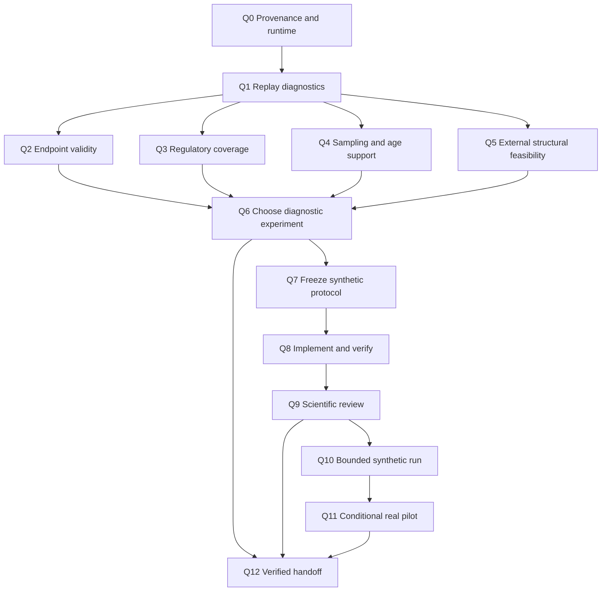

# Data-driven research continuation — 2026-09-30

## Decision and scope

The researcher requests continued experiments guided by Professor Fang, including a dataset change if evidence warrants it. The prior C0–C6 NO FIT decision closed the rejected S8 draft; it does not establish that all future experimental designs should stop. Preserve that decision and S7-v1/v2 INVALID records. Do not restart the rejected protocol.

**Current decision: diagnose task, sampling, measurement, and model adequacy before selecting a new biological experiment or declaring the dataset defective.** The bounded null paper remains a valid record of completed work, not the predetermined destination of this continuation. A positive CA result is not a completion criterion.

This plan is an execution order, not a frozen fitting protocol. Diagnostic inspection is authorized by the current request. Before new fits, commit a separate protocol specifying all numerical choices, implementation, inputs, resource caps, and decision rules. Do not silently promote exploratory findings to confirmation. No paid resources or controlled data are needed for the initial diagnostics.

## Professor sources

- July 2 original vault MOM: [record](</Users/anuragdani/Obsidian Vault/Personal Pet Projects/niw-eb1a/papers/P22/MOM/2026-07-02/MOM_07-02-2026_Transcript_and_Meeting_Notes.md>), especially 00:00–01:10 (specific refinements and cell-state spectrum), 14:12 (equal supervision), 19:30–20:51 (avoid saturated subtype classification; follow reproducible evidence).
- July 21 original vault MOM: [record](</Users/anuragdani/Obsidian Vault/Personal Pet Projects/niw-eb1a/papers/P22/MOM/2026-07-21/MOM_07-21-2026_Transcript_and_Meeting_Notes.md>), especially 03:40 (stratified/donor sampling), 14:02–17:39 (discriminating multimodal benchmark and concat baseline), 25:26 (concrete customization).
- These are professor records. Prior continuation and this plan are worker interpretation. No professor endorsement of a null-paper-only pivot is recorded. The July notes' pending disease-objective approval must be reconciled with later approval records before claiming professor authorization for a changed disease objective; no repeated researcher approval is required for the diagnostics already requested.

## Evidence established now

[DATA_DIAGNOSTIC.json](DATA_DIAGNOSTIC.json) recomputes the saved sample and checks available cell-type/donor counts and age against the current H5AD obs metadata. It does not read new expression/ATAC values or rerun whole-file QC.

| Observation | Decision implication | What it does not establish |
|---|---|---|
| 30 donors, 15/15; 248,998 available cells, 30,000 selected | Donor replication is limited even with many cells | Adequate power, or cause of the null |
| MIC: ≥20 available cells in 9 CON/10 DS donors; ≥20 selected cells in 0/0 | Global donor cap can underrepresent rare types; test targeted sampling | MIC biological disease signal |
| OPC: ≥20 available cells in 12 CON/13 DS; ≥20 selected in 0/0 | Same sampling concern | OPC is best endpoint |
| RG and NEU_CUX2: ≥20 selected cells in 15/15 each | Well-supported types provide diagnostic anchors | Independent biological labels or model advantage |
| Some ages occur in one condition only | Inspect common age support and confounding; donor-level reporting required | Age causes model failure |
| Fresh saved-fold verifier PASS; CA−TC 0.0267, CI [−0.0250, 0.0768] | Advantage not demonstrated on the frozen primary | Equivalence, absence of interaction, or defective dataset |
| Current ATAC uses 256 prevalence/tie-break regions per fold | Representation adequacy is a distinct hypothesis | Broader or regulatory features will improve results |
| S4 detectability and S7 controls do not establish a valid positive interaction control | Model/generator/optimization adequacy remains open | More donors alone will fix the problem |

The 20-cell cutoff is descriptive, not a power or inference gate. No endpoint has been selected by disease effect. Existing pooled/per-fold metric caveats remain; do not diagnose biology from pooled AUROC alone.

## Ordered work and acceptance

### D0 — Cohort/sampling diagnosis: completed

- [x] Saved sampling hash matches the protocol-pinned hash; 30 donors/15 per class/30,000 selected assertions pass.
- [x] Current H5AD obs metadata reproduces every available donor and donor×cell-type count and age.
- [x] Recompute canonical primary from saved folds: verifier PASS, B_NULL retained.

### D1 — Measurement and endpoint audit: next

**Measurement slice completed:** [MEASUREMENT_AUDIT.json](MEASUREMENT_AUDIT.json) freshly verifies the count matrix SHA-256, exact ordered-cell SHA-256 against H5AD, BED SHA-256, 465×248,998 dimensions, nonnegative counts, and saved nnz. Only 0.355% of full-cohort cells have zero counts across the 465-region union. This establishes structural pairing and descriptive panel coverage, not a regulatory-adequacy gate. Endpoint independence and fold-specific regulatory coverage remain open.

Read the actual NN-v2 input manifest, counted BED, ATAC count matrix, and existing recount/adequacy reports. Distinguish this exact-count NN input from older incompatible GEO per-library peak matrices. Reuse existing loaders; do not repeat completed ingestion work.

Deliver `MEASUREMENT_AUDIT.json` and a short report with pairing/order/dimension/hash checks; donor×cell-type RNA/ATAC depth, zero fraction and coverage; fraction of selected cells with usable ATAC; and coverage of the 256-region panel. All summaries are descriptive. Freeze any new feature selection inside training donors only. Preserve measured zeros versus missing regions.

Audit candidate outcomes against professor's cell-state direction: can they be measured independently of the same input genes, or are they derived proxies? Do not call RNA-derived pseudotime or current disease-model scores independent biological truth. Record whether an independently supported maturation/state endpoint exists. If none exists, report endpoint-validation gap rather than invent labels.

Acceptance: traceable measured inputs, quantified coverage, and an endpoint-validity table. A failed pairing/count contract blocks fits. Narrow but valid coverage triggers a representation experiment, not a dataset-rejection claim.

### D2 — Sampling adequacy experiment: design before fitting

**Feasibility slice completed:** [TARGETED_SAMPLING_FEASIBILITY.json](TARGETED_SAMPLING_FEASIBILITY.json) preserves exact selected cell IDs for all 15 types using the existing sampler, seed 22, and descriptive cap 64 per donor per type. It restores ≥20-cell support to MIC 9 CON/10 DS and OPC 12 CON/13 DS, while RG/NEU_CUX2 retain 15/15. No disease-effect calculation or model fit was performed. Class/age support and formal pilot eligibility still need freezing.

Use full available metadata to construct donor×cell-type paired samples, contrasted with the original global-cap sample. Fix eligible types based on cell counts, age support, and endpoint validity before any disease-effect analysis. Preserve all eligible donors; report rare-type exclusions explicitly. Set minimum cells and class-support requirements prospectively, with sensitivity and power rationale; descriptive ≥20 is not automatically the fitting criterion.

First run the sampling comparison without model fits: cells/type/donor, age/sex/library support, effective donor counts, and expected uncertainty. More cells may reduce within-donor measurement noise; they do not create independent donors. Avoid selecting the type with the largest observed disease effect.

Acceptance: a frozen sampling manifest and a decision whether targeted sampling repairs a measured loss of support. If it does not, do not rerun the full ladder merely with more cells.

### D3 — Model and interaction falsification experiment

Build a new analytic synthetic problem with independently generated paired modalities, donor grouping, nuisance factors, an explicitly known pairing-dependent target, and held-out donors. Include a matched no-interaction null, an oracle, unimodal controls, linear concat, MLP concat, gated fusion, token concat, and CA. An oracle validates that the constructed signal is available and destroyed by the intended intervention; it does not validate the learned model.

Specify one primary pairing-use statistic and one separate model-advantage contrast. Generate independent null realizations using the complete fitting pipeline and account for any joint arm rule; constant/Bernoulli predictors cannot calibrate a fitted-model null. Freeze generator/splits/seeds/statistics and calibration/decision allocation before results. Test finite gradients, learning on a small known target, reload equality, and permutation semantics before the experiment. Do not require CA to outperform MLP for a valid pairing-use positive control.

Initial fitting ceiling proposed: 60 total attempted fits, two CPU workers with two torch threads each, four fitting hours, 2 GiB new artifacts; no search or retry beyond that ceiling. A feasibility calculation must show the chosen null/decision design fits this budget. If insufficient, stop at a design/resource blocker; never weaken calibration to fit the budget. Independent scientific protocol review precedes fits; record review evidence.

Acceptance: controls establish valid signal and null behavior. If oracle fails, repair generator before interpreting models. If oracle succeeds but learned models fail, investigate representation/optimization before spending on new disease data. If both concat and CA use pairing, continue fair comparison; that result is not CA superiority.

### D4 — Choose the next real-data experiment

| Diagnostic result | Next action |
|---|---|
| Targeted sampling repairs support; endpoint and measurement pass | One prospective cell-state pilot, using fixed eligible cohorts and matched controls |
| ATAC coverage inadequate, while paired counts valid | One training-only representation comparison using exact counted regions or validated gene-linked features; preserve old primary |
| Pipeline/control fails | Repair and verify that failure; dataset change does not diagnose implementation |
| Endpoint circular or no independent validation available | Select a different task/data source with independent outcome support before model comparisons |
| Adequacy analysis identifies independent donor count as binding | Seek additional independent donors; estimate required counts for a stated effect, not from planted amplitude |
| Current design adequate and controlled experiments stay null | Retain null result; consider external transportability with locked choices |

The pilot must specify donor-level split/inference, equal supervision and selection budgets, one primary endpoint, simpler baselines, chr21/dosage handling where relevant, and held-out pairing/clamping/ablation tests. Declare exploratory scope because current cohort has already been extensively inspected. New runs cannot retroactively replace NN-v2's confirmatory primary.

### D5 — External data feasibility can proceed structurally

NeMO is a different-study candidate with 26 reported donors; it is not a demonstrated remedy for power or an accepted independent cohort. Official archive and ATAC directory were rechecked September 30: open processed child collections and count-package listing remain visible. Reuse local metadata/manifests and source resolver. Resolve the 3,731-row QC discrepancy, specimen provenance, age conventions, count semantics, and common-region contract before predictive evaluation.

Start with bounded manifests/metadata, not full matrix or fragment downloads. Log prior inspection; reserve external predictions from feature choice, tuning and endpoint selection. If NeMO becomes a development cohort, explicitly relinquish its untouched external-test role and identify another evaluation strategy first. Do not pool its donors with current data and call the same cohort external.

Acceptance: `ACCEPTED`, `EXPLORATORY_ONLY`, or a concrete unresolved input blocker, with sources. Public availability and different donor IDs alone cannot establish QC or specimen independence. Inspect a small exact-count pilot before budgeting full downloads/recounting.

## Stop and delivery

Each experiment ends on its specified result or budget, including negative/invalid outcomes. Never widen a null band, change seeds/endpoints, drop difficult donors, or promote a proxy after inspecting results. Preserve original MOM, sent packet, prior primary JSON, and S7 ledgers. Keep new artifacts in this dated folder and new raw roots.

Next deliverable is D1 measurement/endpoint audit plus D2 sampling feasibility, followed by a reviewed D3 protocol. Update status only at a meaningful diagnostic gate/blocker. Prepare a professor update from the last sent packet when requested; worker recommendations remain distinguishable from professor decisions.

Public sources checked: [NeMO collection](https://assets.nemoarchive.org/col-umstjg0), [ATAC processed counts listing](https://data.nemoarchive.org/other/grant/r21_delatorre/delatorre/multimodal/sncell/10xMultiome_ATACseq/human/processed/counts/). GEO page was inaccessible through the browser tool in this check; existing local GEO evidence remains dated.

## Execution amendment: detailed tasks and verification

This amendment turns D0–D5 into Q0–Q12 below. The canonical task checklist is the appended **Data-driven investigation continuation — Q0–Q12** section of [root tasks/todo.md](../../../todo.md). The root [tasks/plan.md](../../../plan.md) points here. Earlier incomplete plans and results retain their original scopes. Launching the supplied command accepts this continuation's execution scope; numerical experiment protocols still require the scientific gates below.

### Dependency graph

Q2–Q5 are independent read-only reports after Q1; they can run concurrently only with separate output files. Model changes, protocol freezes, fits, and gate decisions are sequential. One writer owns status and checklist. No parallel fitting beyond two CPU workers.

### Q0 — Pin provenance and runtime (S)

**Purpose:** Start from reviewed continuation commit `04282f0a803cc40c5d40aa0a9a7c535a213e1560`, preserve the dirty main checkout, and make the plan available inside the new GNHF worktree.

**Acceptance:**
1. `PREFLIGHT.md` records branch/base/source paths, dirty-main fingerprint, plan/diagnostic hashes, raw input paths, interpreter/dependency versions, disk/RAM, and conflicting writers.
2. Copy only this dated plan, prompt and three diagnostic JSONs into the new worktree. Append Q task definitions to its existing root plan/checklist; do not overwrite older task sections. Record source hashes and distinguish copied versus fresh evidence.
3. Existing environment imports and local input availability pass, or named blockers are recorded. No package installation, fit, or download.

**Verification:** `git rev-parse HEAD`, `git status --short`, streaming SHA-256 of owned files; run installed Python imports for numpy/scipy/pandas/h5py/torch. Enumerate tmux/process ownership read-only. Never assume a new worktree contains ignored data or `.venv-p22`; reference the existing absolute interpreter/input paths and verify the imported `p22` module comes from the new worktree's `src`.

**Files:** `PREFLIGHT.md`, copied task documents. **Dependency:** none.

### Q1 — Make saved diagnostics reproducible (M)

**Purpose:** Replace ad hoc one-off checks with one small replay command using existing loaders and sampler.

**Acceptance:**
1. A bounded replay reproduces donor/class/cell totals, all donor×type counts, metadata age, ordered-cell/matrix/BED hashes, and targeted sample IDs. Fresh JSONs go in a new raw root; originals are immutable.
2. Exact comparisons or declared floating tolerance are recorded; fresh ladder verifier PASS/B_NULL reproduced from the shared saved folds. No RNA dense-atlas load, fit, or whole-asset acquisition.
3. Input tampering, changed cell order, missing columns, and output overwrite attempts fail with nonzero exit and useful diagnostics.

**Verification:** Add focused tests for those concrete refusal risks. Replay with `/Users/anuragdani/Github/niw-eb1a/P22/.venv-p22/bin/python`; set `PYTHONPATH` to this worktree's `src`. Run `tests/test_nn_sampling.py`, `tests/test_nn_inputs.py`, and the new diagnostic tests. Invoke `gnhf/verify_ladder.py` with absolute shared ladder and worktree summary paths, without `--write`.

**Files:** one diagnostic script, one test module, `REPLAY.md`, fresh reports. **Dependency:** Q0.

### Q2 — Validate candidate cell-state endpoints (S)

**Acceptance:**
1. `ENDPOINTS.md` lists each candidate's measurement/source, label construction, availability by donor/type, and whether target information overlaps model inputs.
2. Separate independent measured outcomes, contextual covariates such as developmental age, and RNA-derived proxies. Record limitations of each; age is not interchangeable with cell state.
3. Choose at most one defensible endpoint for a future pilot, or record `ENDPOINT_UNRESOLVED`. Do not select by observed CA performance or DS effect.

**Verification:** Trace H5AD fields to author methods/code and original papers; use primary sources for new factual claims. Count missing/duplicate identities. Review whether any target leakage remains. No significance tests or fits.

**Files:** `ENDPOINTS.md`, `endpoint_inventory.json`. **Dependency:** Q1.

### Q3 — Quantify fold-specific ATAC coverage (M)

**Acceptance:**
1. `REGULATORY_COVERAGE.md` reports all 25 training-only 256-region panels, exact count semantics, genomic build/annotation provenance, and coverage by donor/type. Structural and biological adequacy are distinct labels.
2. Quantify zero cells, nonzero regions, depth, chr21 fraction, and defensible gene/regulatory annotation overlap. Overlap counts do not prove regulatory function; missing annotations remain unknown.
3. Propose at most one alternate representation if a measured deficiency exists. Reuse exact counts; new interval counts require a separately costed recount contract. No unmeasured peaks filled with biological zero.

**Verification:** Existing `tests/test_atac_tiebreak_sensitivity.py`, `tests/test_nn_inputs.py`; hand-check interval boundary/overlap examples if annotation code changes. Replay a panel independently from BED and count matrix. Report all panels, not a favourable panel.

**Files:** diagnostic script extension, focused tests if needed, coverage report/JSON. **Dependency:** Q1.

### Checkpoint A — After Q1–Q3

Fresh replay and structural input contracts must pass. Endpoint/coverage unresolved states are acceptable reported outcomes, but cannot authorize a biological fit. Check source hashes, failure tests, and professor-source mapping. Continue Q4/Q5 even if endpoint is unresolved.

### Q4 — Freeze sampling and confounding feasibility (M)

**Acceptance:**
1. `SAMPLING_FEASIBILITY.md` compares original global cap with targeted sampling across all types, including donor/class counts, age/sex/library support and exact selected-cell hashes.
2. Before outcome tests, fix candidate type eligibility, minimum cells/donor, split feasibility, and age/covariate rules from measurement and support. Preserve exclusions with reasons; no performance-based donor deletion.
3. Report uncertainty/adequacy for a stated effect and inference rule. Donor count, not cell count, drives replication. No CI-width proxy or planted amplitude called established biological power.

**Verification:** Reproduce seed-22 sample IDs, verify sampler ignores disease labels, donor-disjoint split manifests, fold class support and training-only transforms. Run `tests/test_nn_sampling.py` and existing group-split tests selected after inventory. Verify prospective sample-size calculations on analytic/toy cases; assumptions explicit.

**Files:** script extension, sampling protocol/manifest, report. **Dependency:** Q1; Q2 informs final endpoint eligibility.

### Q5 — Bound external feasibility research (S)

**Acceptance:**
1. `EXTERNAL_FEASIBILITY.md` audits existing NeMO metadata and current official declarations for QC release discrepancy, specimen provenance, age conventions and feature semantics.
2. Record `ACCEPTED`, `EXPLORATORY_ONLY`, or `UNRESOLVED` separately for each contract. Public link and distinct donor IDs cannot pass QC/independence gates.
3. Compare current dataset repair with external candidate and, if needed, at most two primary-source alternatives selected for independent paired measurements and validated outcomes. Preserve NeMO evaluation role unless explicitly changed prospectively.

**Verification:** Reuse `scripts/resolve_nemo_source.py` and metadata loader. Record request URLs/dates/byte totals; bounded public metadata only. Sources supporting candidate counts/assays/endpoints must be cited. No external predictions.

**Files:** report, source ledger. **Dependency:** Q1.

### Checkpoint B — After Q4–Q5

Support tables and source audit completed or precisely blocked. No data-driven claim that dataset is defective follows merely from a null result or rare-type sampling loss. Inspect Q1–Q5 reports before Q6; retain unresolved flags in the decision.

### Q6 — Select one discriminating experiment (S)

**Acceptance:**
1. `RESEARCH_DECISION.md` ranks task/endpoint, sampling, ATAC coverage, implementation/optimization and donor-count explanations as established/plausible/unknown with supporting and contradicting evidence.
2. Choose exactly one next scientific experiment and alternatives rejected for concrete reasons. State which result would change the research direction and what remains unidentified.
3. Build a fit/resource feasibility ledger before protocol design. If valid calibration cannot fit the resource ceiling, record `DESIGN_UNRESOLVED`; do not shrink controls or relax thresholds to unlock fits.

**Verification:** Cross-check every decision claim against Q reports and original July MOM. Numerical S8 critique must be checked: rounded interval endpoints cannot justify classifying a boundary value; use exact values or remove that illustrative argument. Retain the independent fitted-null mechanism concern. Keep B_NULL, S7 INVALID, and prior NO FIT unchanged.

**Files:** decision, fit ledger. **Dependencies:** Q2–Q5.

### Q7 — Freeze analytic synthetic protocol (S)

**Acceptance:**
1. New protocol ID and `SYNTHETIC_PROTOCOL.json/.md` specify generator equations, oracle, null, nuisance structure, donor units, splits, fixed seeds, seven learned arms, training/selection budgets, and primary pairing-use statistic. Advantage contrast is separately labelled.
2. Null calibration matches the tested mechanism and any arm multiplicity. If using a conditional randomization alternative, prove exchangeability and conditioning/selection validity instead of assuming it avoids refits. Calibration and decision data/seeds are disjoint.
3. Exact count of all attempts, including calibration and smoke fits, is ≤60 and ≤4 fitting hours. No optimum-search loop; stop if a justified design does not fit this cap.

**Verification:** Recompute fit arithmetic, check class support and train-only transforms, inspect analytic target/oracle and shuffle invariants. Commit protocol before model fitting. Calibration outcomes cannot tune a favourable band for the decision set.

**Files:** protocol pair, fit ledger, new tiny split manifest. **Dependency:** Q6. Endpoint failure does not block a synthetic software/mechanism control.

### Q8 — Implement minimal control and falsification tests (M)

**Acceptance:**
1. Reuse model factory, donor sampler/splits, trainer, serialization and aggregation; add only generator/statistic/runner pieces demonstrably missing.
2. Tests verify oracle target, null semantics, modality pairing/marginal preservation, donor isolation, finite gradients, reload equality and refusal on mismatched identities or protocol hashes.
3. Dry-run reports expected fit coverage and resource caps. Tiny trainability checks using learning count toward the fit cap and require a reviewed allowance before execution; fixture tests cannot silently run an unreviewed research experiment.

**Verification:** Run new focused tests plus `tests/test_nn_factory.py`, `tests/test_nn_attention.py`, `tests/test_nn_faithfulness.py`, relevant existing planted/runner tests. Ruff only touched source/test files initially; after integration run required repository gates once. Do not mask existing failures; record baseline versus introduced findings.

**Files:** at most one generator module, one runner, one focused test module, runbook. **Dependency:** Q7. Split into smaller tasks if scope exceeds five files.

### Q9 — Independent scientific and code review (S)

**Acceptance:**
1. Reviewer independently checks equations, estimand, null validity, oracle interpretation, arm/multiplicity rule, leakage, power language, fit arithmetic, safety of output roots and change scope.
2. `NO_FIT_REVIEW.json` names reviewer, reviewed source/protocol hashes, evidence, findings and PASS/FAIL/UNRESOLVED. Worker self-assertion cannot satisfy independent review.
3. Critical findings resolved with focused regression and another review of changed scope; no more than two correction cycles. If independent review capability is unavailable, record `REVIEW_PENDING` and finish other safe tasks.

**Verification:** Reviewer reruns relevant refusal/analytic tests and recomputes protocol/fit hashes. PASS must match exact code and protocol to execute. Q review may use an available separate reviewer agent; no user-owned chats or outbound messages are needed.

**Files:** review and remediation records. **Dependency:** Q8.

### Checkpoint C — Before any research fit

Q7 protocol committed; Q8 relevant tests pass; Q9 independent PASS applies to exact hashes; runtime budget/headroom established. Any critical FAIL/UNRESOLVED blocks Q10. Continue external/source reporting and Q12 rather than repeating an invalid experiment.

### Q10 — Execute one bounded synthetic batch (M)

**Acceptance:**
1. One new raw root, immutable protocol/source/split hashes, attempt ledger, per-fit donor predictions, checkpoint hashes, runtime/resources and failures. Refuse any old S7/S8 or primary root.
2. Enforce ≤60 total attempts, ≤4 fitting hours, two workers×two torch threads, and ≤2 GiB artifacts. Include failed attempts; no restart with fresh counters or hidden retries.
3. Recompute frozen statistics from saved predictions. Report valid pairing positive/negative separately from superiority; invalid/null/oracle failures cannot become model claims.

**Verification:** Separate summary replay from saved sidecars, donor and arm coverage checks, hashes and intervention direction. No refit for verification. If a cap is reached, report INCOMPLETE with remaining coverage rather than partial positive claim.

**Files:** runner changes only if necessary, execution summary, new raw ledger. **Dependency:** Q9 PASS.

### Q11 — Conditional real-data exploratory pilot (M; subdivide protocol/code/run)

**Acceptance:**
1. Only if Q2 endpoint, Q3 measurement, Q4 support and Q10 control interpretation permit it, write and independently review a **separate** pilot protocol selecting one endpoint/representation/sampling comparison. Reconcile historical objective approval records without inventing professor endorsement. Researcher has requested experiments; do not ask again for routine in-scope diagnostics.
2. Freeze exact donor folds, eligible cells/types, covariates, dosage handling, equally supervised baseline/concat/CA models, primary metric/contrast, multiplicity and held-out faithfulness tests. Same extensively inspected cohort implies exploratory status. Minimum class/fold support and stated adequacy must pass before fitting.
3. At most 120 pilot attempts and eight additional fitting hours, with two workers×two threads; total continuation ≤180 attempts/12 fitting hours/4 GiB outputs. No new raw-data acquisition, expansive search, or full-ladder rerun. If candidate cannot fit these limits or scientific gates, deliver precise NO FIT reason and next resource/data requirement.

**Verification:** Protocol arithmetic and independent review before fitting; meaningful tests on leakage, matched budgets and diagnostic interventions; saved-sidecar replay after execution. All attempts across synthetic and real stages share cumulative ledger. No secondary cell-type result silently promoted to primary.

**Files:** pilot protocol, existing runner adaptation and focused test if necessary, results report. **Dependency:** Q10 valid control; Q2–Q4 gates PASS. Q5 needed if proposing external cohort; full external acquisition/evaluation is outside this command's scope.

### Q12 — Verified closeout (S)

**Acceptance:**
1. `HANDOFF.md` lists each Q task as DONE/SKIPPED/BLOCKED with evidence, scientific result, remaining blocker, one next action and exact branch/commit/log/raw paths.
2. `VERIFICATION.json` records actual commands, exit status, timestamps, input/output/code/protocol hashes, tests, reviewer verdict and cumulative resource/fit usage. Do not reuse old test counts as fresh.
3. Update worktree root status/index at accepted gates; preserve primary/S7/professor/sent-packet records. Commit only owned files; no push/merge or sending. A negative or concrete design/data blocker can be complete for this run, while broader study remains partial.

**Verification:** `git diff --check`; relevant focused tests, `make lint`/`make test-fast` after source integration where compatible with existing environment; saved-output replay; local Markdown links, hashes, coverage and claims cross-check. If broad gates fail from inherited code, report that conflict explicitly and do not claim global PASS. Planning/report-only changes need link/hash/diff checks, not full training tests.

**Files:** handoff, verification manifest, owned status/index/checklist edits. **Dependencies:** all applicable tasks; blocked dependencies produce truthful skip reasons.

### Checkpoint D — Stop condition

Stop when Q0–Q12 have evidence-backed dispositions, applicable experiments and verification are complete, and handoff is committed; or when a precise blocking condition remains and all independent safe tasks are exhausted. Maximum two review correction cycles. No repeated search for a positive result, alternate-seed rescue or budget reset. Human review happens on the delivered result; launching does not authorize public release.

### Shared verification and resource rules

- Use existing absolute interpreter with worktree `PYTHONPATH`; save `p22.__file__` to prove source ownership. Do not install packages merely because an isolated checkout lacks its own venv.
- Download ceiling for this run: 64 MiB aggregate public metadata/manifests, at most ten source requests, timeout 30 seconds per request, no payload/count/fragment packages and no author contact. Datasets needing larger acquisition receive a costed proposal.
- Local diagnostic slice: ≤30 minutes, ≤4 GiB peak process memory, ≤1 GiB new diagnostic files. Fits need fresh measured headroom; no full-atlas densification. Use available resource controls; if hard enforcement is required but unavailable, report the limitation instead of claiming enforcement.
- Keep counters durable across GNHF iterations. Freeze all per-stage settings before reading new predictive outcomes. Existing external values do not enter feature or threshold selection.
- Fit labels: NOT_RUN, NO_FIT, INCOMPLETE, INVALID, VALID_NEGATIVE, VALID_POSITIVE, with exact estimand. A passed positive control is not biological validation. Dataset-replacement decision requires measured inadequacy and a candidate that addresses it.
- Verification should resolve concrete risks. Once applicable gates pass, proceed; do not spend repeated full-suite cycles on unchanged prose.
